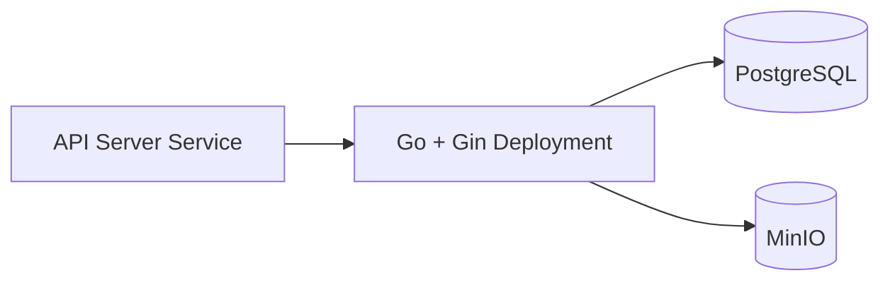

# Report Skills — 変換例集

[SKILL.md](../SKILL.md) の各ルールに対応する Before/After の変換例。
ルールの判断に迷ったとき、または既存文を直すときに参照する。見出しは SKILL.md の章立てと対応している。

## 記号と表記

### 冗長なカッコ補足

```
NG: 共通化（抽象化）によって、別の例（仮想ファイルシステム VFS）も同じ枠組みで扱える。
OK: 抽象化によって、仮想ファイルシステムのような別の例も同じ枠組みで扱える。
```

前の語彙にカッコで言い換えを足す書き方は冗長。片方に寄せる。

### 余計な強調

```
NG: **背景**: この章では前提を整理する。
OK: この章では前提を整理する。
```

太字を見出し代わりに使わない。強調したいなら文の組み立てで効かせる。

### 人間が使わない記号

```
NG: コスト・品質・速度の三点を、多角的な視点—すなわち運用面—から検討する。
OK: コスト/品質/速度の三点を、運用面から検討する。
```

中点は `/`、emダッシュは読点や「つまり」で言い換える。カギカッコの多用も避ける。

### 番号のハードコード

直接マークダウンに数字を振らない。

```
NG:
1. 有線LANと無線LANについて、物理層からデータリンク層の違い、
   ネットワーク層から見た共通化までを順に検討する。
2. 下位層は違うのに、ある層から上では同じに見える。

OK:
* 有線LANと無線LANについて、物理層からデータリンク層の違い、
   ネットワーク層から見た共通化までを順に検討する。
* 下位層は違うのに、ある層から上では同じに見える。
```

見出しに振るのも禁止。

```
NG:
## 1. 課題1：有線LANと無線LANの比較
### 1.1 物理層の違い

OK:
## 有線LANと無線LANの比較
### 物理層の違い
```

後からの編集で順番や項目数が変わると番号が破綻するため。

### アスキーアートで図を描かない

```
NG:
+-------------------------------------------------------------+
|                         Kubernetes                          |
|  +----------------------+      +--------------------------+  |
|  |  API Server Service  |----->|  Go + Gin Deployment     |  |
|  +----------------------+      +------------+-------------+  |
|        +-------------------+              +----------------+ |
|        | PostgreSQL        |              | MinIO          | |
|        +-------------------+              +----------------+ |
+-------------------------------------------------------------+
```

このようなアスキーアートは人間は書かない。特に複雑なものは書かない。図が必要なら Mermaid を使う。

````
OK:

````

## 文のリズム

### 文末を単調にしない

```
NG: 課題は3つだ。1つ目は速度だ。2つ目はコストだ。3つ目は保守性だ。
OK: 課題は3つある。速度、コスト、そして保守性。なかでも保守性が後々効いてくる。
```

同じ語尾が3回続いたら崩す。である調なら「だ」「体言止め」を混ぜる。

### 接続詞を多用しない

```
NG: さらに速度が向上する。また、コストも下がる。加えて、保守性も上がる。
OK: 速度が向上し、コストも下がる。保守性まで上がる。
```

順接の接続詞は無くても繋がることが多い。削れるなら削る。

### 段落の長さと閉じ方を揃えない

```
NG: 各段落が同じ長さで、毎回「以上がポイントである。」で閉じる。
OK: 短い段落と厚い段落を混ぜる。閉じ方も変え、ときに余韻を残す。
```

## 語彙と文体

### 受動態の過剰使用

```
NG: 比較が行われた結果、差が確認された。分析も実施された。
OK: 比較した結果、差が出た。分析もした。
```

### 根拠のない評価語

```
NG: コストと品質の両面で非常に非効率である。
OK: トークン消費が増え、重要な指示が埋もれやすくなる。
```

評価語を並べず、何がどうなるかを動詞で具体的に書く。

### AI語彙の置き換え

```
NG: 本ツールは包括的かつ革新的で、シームレスな連携を実現する。
OK: このツールは設定なしで既存のCIにつながる。
```

次の語が高密度で出るとAIっぽくなる。置き換えるか削除する。

> さらに / また / 加えて / 包括的 / 革新的 / シームレス / 多角的 / 本質的 / 不可欠 /
> 重要な役割を果たす / 大きな意義を持つ / 注目に値する / 示唆に富む / 興味深いことに

### 三点セットを無理に作らない

```
NG: 速度、コスト、保守性の三点で優れている。（実際に言いたいのは2点）
OK: 速度とコストの両面で優れている。
```

### 言い換え連打をしない

```
NG: テストは重要だ。大切な工程であり、欠かせない作業でもある。
OK: テストは欠かせない。
```

同じ対象の用語も統一する。「ユーザー」「利用者」「顧客」を混ぜない。

### 保険・ヘッジを常設しない

```
NG: 一概には言えないが、一般的には有効であると考えられる。
OK: 同時接続が1000を超える環境で有効。それ以下では差が出ない。
```

条件があるなら具体的に書く。無いなら言い切る。

### 定型の導入・締めを使わない

```
NG: ポイントは以下の通りである。… 参考になれば幸いである。
OK: （前置きを削り、直接内容を述べる。末尾の決まり文句も削る）
```

「〜ではないだろうか」のような問いかけ風の締めも避ける。
