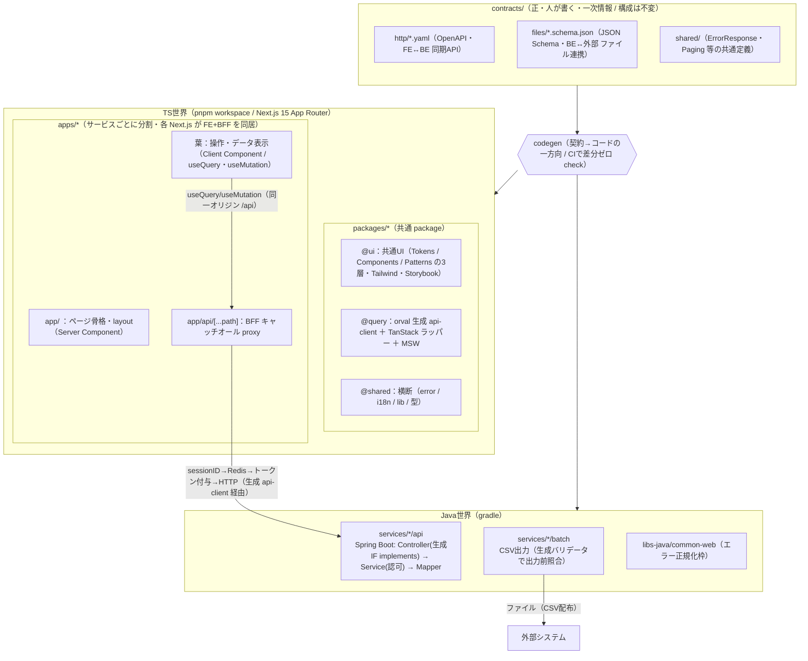

**# 全体基本設計書**

>本書は契約駆動の実システム（****FE: Next.js 15 / App Router の FE+BFF monorepo****＋ BE: Java / Spring Boot）全体を貫く****設計思想・全体アーキテクチャ・契約・機械ゲート・検証計画****を定義する。

>FE / BFF / BE の具体は 10-FE.md / 30-BFF.md / 20-BE.md に置く。重複は本書（①）に寄せ、各論は本書を参照する。

>PoC（`app/contracts_poc`）は****設計を実証した検証エビデンス****として参照する位置づけであり、PoC 自体の設計書ではない。

>****改版方針（重要）****: 本書は「React 19 単体 SPA」前提から「****Next.js（FE+BFF）＋ TanStack Query ＋ サービス分割モノレポ****」へ全面改訂した版である。一次情報は nextアーキテクチャ検討.md・FE知見共有会.md・UI開発の考え方.md・FE配信_認証.md。****10-FE.md（React/Vite 前提）・30-BFF.md（Client 中心・TanStack 未採用前提）は本書に追従して改版が必要****（§3 末尾・§9）。

- **--**

**## 1. 目的とスコープ**

**### 1.1 目的**

契約（`contracts/`）を全システム間インターフェースの一次情報とし、そこから FE / BFF / BE の各世界へ一方向に codegen する「契約駆動開発」を本番プロダクトの設計原則として確立する。****正しさを散文のレビューではなく機械が落とすゲートに寄せる****ことを全体を貫く方針とする。

**### 1.2 スコープ**

- 対象: 契約駆動の実システム全体。FE（TS 世界・Next.js）と BFF（TS 世界・Next.js Route Handlers）と BE（Java 世界）を貫く設計。
- 本書が定義するもの: 設計思想・全体アーキテクチャ・契約の扱い・システム間インターフェース・横断的な機械ゲート・横断的関心事・検証計画 V-1〜V-5・ロードマップ・ADR / 制約一覧。
- 本書が定義しないもの: 各世界の実装詳細（FE → ②10-FE.md、BFF → 30-BFF.md、BE → ③20-BE.md）。API 仕様そのもの（BE 提供の契約が一次情報）。
- 前提: ***BE の実コードはまだ存在しない****。BE に関する記述は「設計＋検証計画」が中心であり、実装値（マスタ名・エラーコード採番・認可モデル）は***ダミー / 未確定として明示****する。

**### 1.3 PoC の位置づけ**

PoC は本番モノレポの****縮小相似形****として、設計の核（契約→codegen→機械ゲート）が最小の縦切り1本で成立することを実証した。FE-native の検証（V-1 TS 側 / V-2 / V-3 / V-5）は****React + ui-engine****で実証済みである。その後 FE は****Next.js（FE+BFF）採用を決定し、UI の構想（共通定義の層構成・状態の二分・取得経路）まで固めた****。本書はその確定方針を反映する。PoC コードは原則使い捨てだが、契約の書き方・CI 設定・破壊テスト手順・ui-engine の設計知見・メタ定義駆動 UI は本番へ持ち越す。

- **--**

**## 2. 設計思想**

出典: `.claude/steering/00-principles.md`・nextアーキテクチャ検討.md・UI開発の考え方.md。一次ソースは Anthropic Claude Code Best practices / React 公式 "You Might Not Need an Effect" / TanStack Query 公式 / Next.js 公式 Authentication / M3。

1.****契約駆動****。`contracts/`を全システム間インターフェースの正とし、コードから契約を生成しない一方向 codegen に統一する。AI に契約を直接編集させない（ADR-0002 / 0009）。

2.****サービス分割モノレポ****。単一リポジトリに束ねつつ****サービス（配信単位）ごとに分割****し、共通処理は****共通 package（UI / query / 横断）に集約****する。境界（サービス間直接参照・レイヤ逆流・越境）は機械で禁止し、共通化の昇格フローを仕組みで強制する。共通基盤は BE 側も`libs-java`に分離する。

3.****状態の二分（サーバー状態 / クライアント状態）****。API データ＝****サーバー状態は TanStack Query が所有****し、画面に閉じた****UI 状態は Jotai****（・`useState`）が持つ。「状態は全部 Jotai」は明確に縮小する。読み取り`useXxxState`（= `useQuery`ラッパー）と書き込み `useXxxAction`（=`useMutation`ラッパー＋`invalidateQueries`）の責務分離は維持する。

4.****不要 useEffect の排除****。派生状態の計算 / 状態の連鎖更新 / イベント処理を `useEffect`で書かない。手書きの `useEffect`＋`setState`による再取得は****TanStack Query の `invalidateQueries`（取得→キャッシュ→無効化の宣言的ループ）が正規の置き換え****である。`react-you-might-not-need-an-effect`全8ルールを error で機械強制する。

5.****Server/Client 境界を先に固定する****（Next.js）。ページ骨格・`layout`は****Server Component****、操作・データ表示の葉だけ****Client Component****（`'use client'`は葉に押し下げる）。データ取得は****TanStack Query（クライアント）＋ BFF プロキシ****を基本とし、読み取りに RSC fetch を原則使わない（テスト容易性＝MSW を最優先）。

6.****UI の揺れを枠で潰す****。AI が破綻する根本原因は「毎回バラバラの数値を発明する」こと。対策は直すことではなく****選択肢を狭める枠****を先に作ること: ①デザイントークンを Tailwind に固定（任意値`[13px]`は ESLint 禁止）、②既存共通部品で組ませる（新規 atom を発明させない）、③お手本の類似画面を1つ渡す、④検証ゲート（Storybook→VRT）を回せる状態にする。

7.****層で基準を分ける配置****。粒度ではなく****役割で整理するのはライブラリ層****（共通 UI package = Tokens/Components/Patterns の3層）、****利用範囲で配置するのはアプリ層****（ページコロケーション）。FE は Atomic Design を採らない（ADR-0017）。

8.****正しさを機械に寄せる****。散文の規約は逸脱しうる。強制力は型 / lint / dependency-cruiser / ArchUnit / codegen:check / contract test に置く。ここに無い規約は努力目標とみなす（`05-enforcement.md`）。

**### 開発の進め方の原則**

- 不確実なら実装せず質問する。スコープ拡大は提案にとどめる。
- 検証手段のないものはマージしない（型 / lint / テストいずれかの合否シグナルを必ず伴わせる）。
- 探索→計画→実装→コミットを分ける。複数ファイル・不慣れな箇所は plan mode を使う。
- 過剰設計を避ける。正しさと要件に効く指摘だけ対応する。
- UI は1単位（1コンポーネント or 1ページ）ずつ切り、状態（hover/focus/disabled/loading/empty/error）を最初から網羅させ、検証経路（Storybook→VRT）をセットで回す。
- **--**

**## 3. 全体アーキテクチャ**

`contracts/`（正・人が書く）→ codegen（CI で差分ゼロチェック）→ FE / BFF（TS 世界・Next.js） / BE（Java 世界）。FE と BFF は****1つの Next.js アプリ（FE+BFF）として同居****し、サービスごとに独立配信する（1 Pod / EKS /`next start`）。



**### 3.1 モノレポ構成**

```

root/

├── contracts/              # 契約（正・人が書く・一次情報）。構成は従来どおり不変

│   ├── http/  files/  shared/

├── apps/                   # TS世界：サービスごとの Next.js（FE+BFF を同居・独立配信 1 Pod）

│   ├── app/                # @app   メインアプリ（デスクトップ/モバイル統合・レスポンシブ）

│   ├── app-admin/          # @app-admin  管理者向け

│   └── app-ext/            # @app-ext    外部公開向け

├── packages/               # TS世界：共通 package（UI と query 等の共通処理を集約）

│   ├── ui/                 # @ui     共通UI（Tokens / Components / Patterns の3層）

│   ├── query/              # @query  orval 生成 api-client ＋ TanStack ラッパー ＋ MSW

│   └── shared/             # @shared 横断（error / i18n / lib / 型・複数サービス共有）

├── services/               # Java世界：サービスごとの BE（api / batch）

├── libs-java/              # Java世界：BE 共通基盤（common-web 等）

├── patches/                # サードパーティパッチ

└── scripts/                # ビルド / CI

```

- 依存はルート `package.json`（TS）/ ルート gradle（Java）に集約。各サービスの設定はスクリプト定義中心。
- 各 Next.js アプリは ***FE（画面）と BFF（`app/api`）を同居****させ、サービス単位で配信する。デスクトップ/モバイルでコードを分けない（単一アプリがレスポンシブで両対応）。
- 共通処理は ***`packages/`に集約****する。アプリ直下に共有置き場（`components/`等）を新設しないことで昇格を強制する。

**### 3.2 共通 UI package の3層（Atomic Design は採らない）**

出典: FE知見共有会.md Q1・UI開発の考え方.md。

```

③ Patterns / Templates 層 … 配置・レイアウト・ページ組み立ての定石（コンポーネントの足し算だけでは画面にならない）

② Components 層           … 役割9カテゴリでフラット分類（M3 を下敷き・粒度=Atomic Design は採らない。状態は hook ＋ フラグで表現）

① Tokens / Foundations 層 … 色・余白・タイポを `tailwind.config` の `theme` に固定（数値の再発明を止める）

```

- スタイリングは ***Tailwind に一本化****。arbitrary value（`w-[137px]`）は原則禁止・ESLint 検出（§6）。
- UI は `@ui`の部品を組み立てて作る。アプリ側で部品を自前定義しない（無ければ実装せず報告して止める）。

**### 3.3 依存方向**

- 依存方向: 共通層（`@ui`/`@query`/`@shared`/`libs-java`）→ アプリ / サービスの一方向。共通層はアプリを参照しない。サービス間・アプリ間の直接参照は禁止し機械強制する。
- UI → Logic → Data の一方向。UI から直接 fetch しない。読み取りは`useXxxState`（useQuery）、書き込みは `useXxxAction`（useMutation）経由。BE への到達は ***BFF プロキシ1本****を通る。
- 両世界とも契約から生成し、***生成物（`generated/`等）の手書き改変を禁止****する（再生成で上書きされる前提）。
- 構造詳細は 10-FE.md（FE）/ 30-BFF.md（BFF）/ 20-BE.md（BE）。***両 FE 文書は React/Vite・Client 中心前提の旧記述を含むため、本書の Next.js+TanStack 方針へ追従改版が必要****（§9）。
- **--**

**## 4. 契約（一次情報）**

出典: `02-api-contract.md`・30-BFF.md §4・ADR-0002 / 0009。****契約の構成は従来どおり不変****。

**### 4.1 契約の構成**

`contracts/`は OpenAPI 専用ではなく、****全システム間インターフェースの正****である。

| ディレクトリ | 内容 | 駆動するもの |

|---|---|---|

| `contracts/http/`| OpenAPI。FE↔BE の同期 API | TS 型 / api-client / TanStack hooks / MSW モック・Java interface / model |

| `contracts/files/`| JSON Schema（＋ファイルメタ: 文字コード・区切り・ヘッダ・改行）。BE↔外部システムのファイル連携 | Java DTO ＋バリデータ |

| `contracts/shared/`| `ErrorResponse`・`Paging`等の共通コンポーネント | 両世界が共有参照 |

**### 4.2 契約の扱い（厳守する原則）**

- ***方向は常に契約→コードの一方向****。コードから契約を生成しない（ADR-0002）。
- ***AI に契約 yaml / schema を直接編集させない****（ADR-0009）。契約改版は人が行い、レビューを必須とする。
- design-first。各レスポンスに `examples`を必ず書く（MSW モック・テストフィクスチャの源泉。FE V-3）。
- 「契約→生成→I/O 境界で機械照合＋ codegen:check でドリフト検知」という思想は、***HTTP でもファイルでも同型****に効く。ファイルメタも契約に同居させ、手書き定数にしない。
- 実行時バリデーション: TS の型はコンパイル時のみ。実行時のレスポンス保証は***Zod スキーマ****で行う（FE）。型と Zod の二重管理は`z.infer`で回避する。フォームは React Hook Form + Zod（`@hookform/resolvers`）で組む。
- ケース変換: BE が snake_case、FE 内部は camelCase。***生成時（orval）に camelCase 化するか、境界で`camelcase-keys`/`snakecase-keys`か、BE に camelCase を出させるかは残論点****（nextアーキテクチャ検討.md §5）。ドメイン型は camelCase で扱う。

**### 4.3 codegen の経路（TS 世界）**

- ***FE（ブラウザ・Client Component）****: ***orval****で OpenAPI →`useQuery`/`useMutation`hooks を生成し、生成クライアントの***baseURL を `/api`（BFF プロキシ）****に向ける。型・Zod・MSW ハンドラも契約から生成する。
- ***BFF（Route Handlers）****: 同じ OpenAPI から生成した型 / クライアントで BE を叩く。BFF は独自の型を手書きしない。
- ***BE（Java）****: 契約から interface / model を生成し、Controller が `implements`する（双方向 codegen・V-1 の Java 側）。

**### 4.4 契約変更手順**

1.BE 提供の API 仕様（スキーマ / OpenAPI 等）を一次情報として確認。

2.`contracts/`（型と対応する Zod スキーマ / Java DTO）を更新。

3.影響する消費箇所（FE `useXxxAction`/ BFF Route Handler / BE Controller・batch）を洗い出し plan に列挙。

4.codegen 再実行 → 型チェック・contract test を通す（§6）。

- **--**

**## 5. システム間インターフェース**

**### 5.1 通信路**

- ***ブラウザ ↔ BFF****: 同一オリジン HTTP。Client Component の `useQuery`/`useMutation`（生成 api-client）が***BFF キャッチオール proxy（`app/api/[...path]`）****を叩く。ブラウザは BE の URL もトークンも知らない。
- ***BFF ↔ BE****: HTTP（同期 API）。OpenAPI 契約準拠。BFF は整形せず***素通し中継****し、認証トークンを付与する（30-BFF.md）。
- ***BE ↔ 外部システム****: ファイル連携（CSV 配布）。JSON Schema 契約準拠。batch が出力直前に生成バリデータで照合する（③ §5 / V-4）。

**### 5.2 認証境界（BFF / Token Handler）**

出典: FE配信_認証.md・30-BFF.md §5・nextアーキテクチャ検討.md §1。

```

ブラウザ（httpOnly Cookie の sessionID のみ・JWT/トークンを持たない）

│ Cookie(sessionID) 付き

▼

Next.js Pod / BFF キャッチオール proxy（app/api/[...path]）

│ sessionID → Redis（サーバー側にトークン保持）→ Bearer 付与

▼

Spring API（トークン検証 ＋ 認可 ADR-0008）→ DB

```

- ***ブラウザに JWT を置かない****。トークンは Redis にサーバー側保持し、BFF が cookie の sessionID から引いて BE へ`Bearer`で付け替える。
- IdP は ***Cognito****（Authorization Code・トークン交換はサーバー側）。PoC / 初期は固定 JWT で代替し、本番化（Cognito 接続）は***BFF 内の差し替えで完結****（FE も BE も不変）。
- ***認可は BE Service 層のみ****で判定する（ADR-0008）。FE / BFF / Controller / Mapper に認可を書かない。BFF は認証（トークン受け渡し）止まり。

**### 5.3 エラー型（共通）**

- API エラーは共通 `ErrorResponse`（エラーコード・メッセージ・相関 ID）で構造化する。HTTP ステータスは ***6 コードのみ****使用する（ADR-0010・個別エラー画面を作らない）。
- エラーコード採番（`PJ-MST-0001`形式）は error-standards 確定待ちのため***ダミー採番と明記****して使用する。
- BE は `common-web`が例外→6 コード＋`ErrorResponse`へ正規化し相関 ID ログを出す（③ §7）。***BFF は`ErrorResponse`を透過****（握りつぶさない・作り替えない。BFF 起因のエラーも同じ枠に正規化）。FE は受けた`ErrorResponse`を `ApiError`で構造化し `useErrorAction`/`useXxxErrorHandlingAction`に一元化する（② §4）。
- 401（セッション切れ）/ 403（権限なし）の UI 挙動（再ログイン誘導・編集中データ保護）は`useErrorAction`接続で扱う（残論点・nextアーキテクチャ検討.md §5）。

**### 5.4 ページング・相関 ID**

- ページングは `contracts/shared`の `Paging`共通定義を両世界で参照する。
- 相関 ID は BE が発番しログ・`ErrorResponse`に載せ、BFF はこれを透過する。
- **--**

**## 6. 機械ゲート（横断）**

出典: `05-enforcement.md`・README スクリプト表。****規約はどのゲートが落とすかとセットで定義する。****

| 規約 / 守りたいこと | 強制手段 | 世界 | タイミング |

|---|---|---|---|

| 契約⇔コードのドリフト・生成物手書き改変 | codegen:check（再生成して `git diff --exit-code`） | FE / BFF / BE | 編集後 / CI |

| 契約破壊が消費コードを止める（V-1） | tsc --noEmit（FE/BFF）/ javac コンパイル（Java interface implements） | FE / BFF / BE | コミット前 / CI |

| クライアント直 fetch 禁止（取得は生成 client + TanStack 経由・BE 到達は BFF 1本） | ESLint（no-restricted-globals / no-restricted-syntax） | FE | 編集後 / CI |

| `'use client'`は葉のみ・`page`/`layout`は Server のまま | ESLint（境界ルール）＋レビュー | FE | 編集後 / CI |

| 契約境界で Server Actions を使わない（契約駆動を保つ） | ESLint（`'use server'`使用箇所制限）＋レビュー | FE / BFF | 編集後 / CI |

| BFF が認可・業務ロジック・整形を持たない（ADR-0008） | dependency-cruiser（BFF→認可/業務参照禁止）＋レビュー | BFF | 編集後 / CI |

| FE ページが BFF 内部実装を直 import しない | dependency-cruiser / import/no-restricted-paths | FE / BFF | 編集後 / CI |

| レイヤ依存方向・生成物直参照禁止（V-2） | dependency-cruiser（TS）/ ArchUnit（Java） | FE / BFF / BE | 編集後 / CI |

| サービス間 / アプリ間直接参照禁止 | import/no-restricted-paths（TS）/ ArchUnit（Java） | FE / BFF / BE | 編集後 / CI |

| 生成 IF を実装している（契約外 API を生やさない） | ArchUnit（implements 強制） | BE | CI |

| Rules of Hooks / 純粋性・不要 useEffect | eslint-plugin-react-hooks ＋ Strict Mode・react-you-might-not-need-an-effect（全8ルール error） | FE | 編集後 / CI |

| デザイントークン逸脱（任意値）の禁止 | ESLint（Tailwind arbitrary value 検出） | FE | 編集後 / CI |

| 文言ハードコード禁止（メッセージカタログ外出し） | ESLint（no-literal-string）＋メッセージカタログ | FE | 編集後 / CI |

| 命名 / import 順 / no-any | @typescript-eslint | FE / BFF | 編集後 / CI |

| モックと本物 BE が同一契約に従う | 双方向 contract test（Pact / schema 突合） | FE / BFF / BE | CI |

| 振る舞い（単体 / 統合） | Vitest + MSW + Testing Library（FE/BFF）/ JUnit（BE） | FE / BFF / BE | CI |

| E2E | Playwright | FE | CI |

| ビジュアル回帰（VRT） | Storybook + storycap + reg-suit | FE | CI |

| スペル | cspell | FE | コミット前 / CI |

| コミット前一括 | simple-git-hooks + lint-staged | FE / BFF | コミット前 |

| 全ゲート通過をマージ条件に | CI（GitHub Actions） | FE / BFF / BE | PR |

- hook の方針（`.claude/settings.json`）: ファイル編集後に lint / typecheck を即時実行する。危険操作（契約 / API 型定義ディレクトリの無断書き換え・依存追加・push）は ask/deny に置く。コミット前ゲートは simple-git-hooks + lint-staged が担い、Claude Code の hook は編集直後の即時フィードバックに絞る。
- TanStack Query の正しさは規約で担保する: ***QueryClient はサーバーで毎リクエスト新規・クライアントは singleton****（factory パターン。サーバーで使い回すとユーザー間でキャッシュ漏れ＝重大バグ）。Provider は`'use client'`の Providers に入れ `app/layout.tsx`（Server のまま）から呼ぶ。
- **--**

**## 7. 横断的関心事**

| 関心事 | 方針 | 詳細 |

|---|---|---|

| 状態管理 | ****サーバー状態 = TanStack Query / クライアント UI 状態 = Jotai（・useState）****。`useXxxState`＝`useQuery`ラッパー、`useXxxAction`＝`useMutation`＋`invalidateQueries`。queryKey は配列・階層的・パラメータ必須（`['order', id]`）、`enabled: !!id`で早撃ち防止。`staleTime`/`gcTime`の既定は基幹データ短め / マスタ系長め | ② / nextアーキテクチャ検討.md §3-4 |

| データ取得モード | 基本は****モードA（純クライアント取得・`useQuery`のみ）****。初期ちらつきが問題になる画面だけ****モードB（Server で `prefetchQuery`→`dehydrate`→`HydrationBoundary`）****へ部分昇格。両モードを混線させない | ② |

| 認証 | BFF / Token Handler。ブラウザは httpOnly Cookie の sessionID のみ、トークンは Redis にサーバー側保持。IdP は Cognito（PoC / 初期は固定 JWT）。本番化は BFF 内差し替えで完結 | §5.2・30-BFF.md §5 |

| 認可 | ****BE Service 層のみ****で判定（ADR-0008）。FE / BFF / Controller / Mapper に認可を書かない。権限による UI 出し分けに何（ロール / can-do フラグ）をどの形でもらうかは残論点。認可モデル（ロール体系・粒度）は未確定で****スタブ****、本番スキーマへ差し替え | ③ §6 |

| エラー正規化 | BE `common-web`が例外→6 コード＋`ErrorResponse`。BFF は透過。FE は`ApiError`（TanStack の `onError`/`throwOnError`）で構造化し一元ハンドリング | §5.3・② / 30-BFF.md §6 |

| UI / スタイリング | Tailwind 一本化＋トークンを `tailwind.config`に固定。共通 UI は`@ui`の3層（Tokens/Components/Patterns）。ローディング/エラーは TanStack の`isPending`/`isError`、`error.tsx`は遷移時の枠 | §3.2・UI開発の考え方.md |

| i18n / 文言 | ****多言語は基本不要****（@app-ext のみ将来要確認）。文言外出しは****メッセージカタログ＋ESLint`no-literal-string`****で担保（多言語対応と文言外出しは別目的）。バリデーションメッセージもカタログ / i18n キーで持つ | ② |

| モックデータ | MSW を****開発とテストで共用****。BFF エンドポイント（同一オリジン`/api`）をモックし、モックは契約 `examples`由来で手書きしない。本番ビルドは removeMSW で除外 | ② / 30-BFF.md §7 |

| ログ / 監視 | 相関 ID 付きログ。FE は Datadog RUM。監視基盤連携の詳細は本番化軸（§9） | ③ §7 |

| 環境変数 / 秘匿 | 秘匿値（トークン・IdP シークレット）はサーバー側（BFF / Redis）に閉じ、ブラウザに出さない | §5.2 |

- **--**

**## 8. 検証計画 V-1〜V-5**

PoC の検証項目を FE-native / BE-native で分類する。判定はすべて「人が読んで確認」ではなく「機械が落とす / 自動テストが通る」で行う。

| V | 項目 | 合格基準 | 住処 | 実証状況（エビデンス） |

|---|---|---|---|---|

| V-1 | 契約→双方向 codegen 破壊 | 契約 yaml を改変すると TS 側（FE/BFF）・Java 側の両方がコンパイルエラーで止まる | FE/BFF(TS) ＋ BE(Java) |****TS 側のみ実証済****。Java 側（双方向）は BE フェーズ（PoC README V-1） |

| V-2 | 越境・改変の機械検知 | クライアント直 fetch / レイヤ違反 / `generated/`手書き改変が CI で落ちる | FE 中心（＋BE は ArchUnit） | ****FE 側実証済****（ESLint / dependency-cruiser / codegen:check。PoC README V-2） |

| V-3 | モックによる並行開発 | BE 未完成でも MSW モックだけで FE の結合テストが通る | FE / BFF | ****画面（render→DOM）結合まで実証済****（V-5 で昇格）。Next.js 化後は BFF エンドポイントをモック（PoC README V-3） |

| V-4 | CSV 契約の機械検証 | JSON Schema から DTO＋バリデータを生成し、契約外 csv が取込/出力時に弾かれる | ****BE(Java)****| ****TS 試作→revert 済・BE フェーズへ****。具体設計は 20-BE.md §5 のみに置く |

| V-5 | メタ定義駆動 UI | マスタ個別の画面コードなしで、メタ定義差し替えだけで複数マスタ画面が動く | FE | ****実証済（React）****。`@poc/ui-engine`で同一`<MasterCrudPage>`が dept/price を render→DOM 描画。****Next.js（App Router / BFF / TanStack）採用を決定し、配線は本番フェーズ****（10-FE.md §8・v-5/検証メモ.md） |

>****注記（V-4）****: ファイル連携（CSV）は BE↔外部システムの責務であり、TS(ajv)で組んでも本番の Java ツールチェーンとは別物となり「検証」にならない。よって本書では「V-4 は BE で実施」とのみ記し、具体設計は ③ にのみ置く。FE 設計書（②）には V-4 を書かない。

- **--**

**## 9. ロードマップ**

- ***FE フェーズ（実証済・TS-only PoC / React）****: V-1(TS) / V-2 / V-3 / V-5 を React + ui-engine で実証済み。FE-native（V-1,2,3,5）が出揃った。
- ***Next.js 移行フェーズ（FE 確定方針・現在の主軸）****:

-SPA（React/Vite）→ ****Next.js 15 App Router****へ移行。FE+BFF を1アプリに同居（1 Pod / EKS / `next start`）。CVE-2025-29927 回避で最低 15.2.3。

-データ層を ****TanStack Query****に再編（`useXxxState`/`useXxxAction`を`useQuery`/`useMutation`ラッパーへ）。orval で OpenAPI →hooks 生成、baseURL を`/api`（BFF）に。

-モノレポを****サービス分割 ＋ 共通 package（`@ui`/`@query`/`@shared`）****へ再編。

-共通 UI を ****3層（Tokens/Components/Patterns）＋ Tailwind トークン固定****で整備（Storybook + VRT）。

-認証境界（cookie→Redis→トークン→Spring）を BFF キャッチオール proxy で実装。ui-engine / RHF / MSW 資産を温存しつつ配線。

- ***BE フェーズ（次）****:

-V-4（CSV 契約・Java DTO＋バリデータ・batch 出力前照合）

-V-1 の Java 側（双方向 codegen・契約改変で Controller がコンパイルエラー）

-ArchUnit（Java レイヤ依存・生成 IF implements 強制）

-双方向 contract test（モックと本物 BE が同一契約に従う / Pact・schema 突合）

- ***本番化軸（別軸）****:

-固定 JWT → Cognito 接続（BFF 内の差し替えで完結。FE / BE 不変）

-ローカル batch → StepFunctions / CronJob（共通枠の置き場が分離済みのため個別バッチは不変）

-スタブ認可 → 本番スキーマ（判定の置き場は Service 層のまま不変）

-契約に transaction / accounting / gw を追加（構造は同形・増やすだけ）

- ***追従改版が必要な文書****: 10-FE.md（React/Vite・サーバーキャッシュ層なし前提）・30-BFF.md（Client 中心・TanStack 未採用前提）を、本書の Next.js+TanStack+共通 package 方針に合わせて改版する。
- **--**

**## 10. ADR・制約一覧**

出典: `00-principles.md`・30-BFF.md §10。

| ADR | 制約 |

|---|---|

| ADR-0001 | リポ分割・言語別分割をしない。横断資産（contracts / packages / libs-java）に業務ロジックを置かない |

| ADR-0002 | 契約は design-first。コードから契約を生成しない |

| ADR-0003 | マスタ個別の画面コード・マスタ別フォルダを作らない（メタ定義駆動） |

| ADR-0008 | 認可判定は BE Service 層のみ。FE / BFF / Controller / Mapper に書かない。認可スキップ分岐を作らない |

| ADR-0009 | 生成ディレクトリの手書き改変禁止。AI に契約 yaml を直接編集させない。CI チェックを無効化しない |

| ADR-0010 | HTTP ステータスは 6 コードのみ。個別エラー画面を作らない |

| ADR-0011 | バッチ: 冪等性・0 件正常終了・処理時間ログ。共通枠を個別実装しない |

| ADR-0012 | ****ランタイム契約検証（req/res の実行時照合）は Proposed（未決）****。導入も省略も確定しない。AI 側から先行実装しない |

| ADR-0013 | ****FE は Next.js 15 App Router を採用****。ルーティングはファイルベース（`app/`+`page.tsx`/`layout.tsx`）。****旧「ルーティングはコード定義ベース（`createBrowserRouter`）」は取り下げ／改訂****。ルートガードは`layout.tsx`+ 認証ゲート（`proxy.ts`） |

| ADR-0014 | ****FE+BFF を1つの Next.js アプリに同居****し、サービスごとに独立配信（1 Pod / EKS /`next start`）。BFF は認証境界（cookie↔Redis↔Bearer）＋素通し proxy に限定し、認可・業務ロジック・整形を持たない |

| ADR-0015 | ****サーバー状態 = TanStack Query / クライアント UI 状態 = Jotai****。orval で OpenAPI →`useQuery`/`useMutation`を生成し baseURL を `/api`（BFF）に向ける。手書き `useEffect`＋`setState`の再取得は `invalidateQueries`に置き換える |

| ADR-0016 | ****Server/Client 境界****: ページ骨格・`layout`は Server、操作の葉だけ`'use client'`。データ取得は TanStack Query（クライアント）＋ BFF プロキシを基本とし、****契約境界で Server Actions を使わない****（design-first・examples 由来 MSW・codegen:check の統制内に保つ） |

| ADR-0017 | ****共通 UI は Atomic Design を採らない****。役割で整理する3層（Tokens/Foundations・Components 役割分類・Patterns/Templates）＋ Tailwind トークン固定。任意値（arbitrary value）は ESLint で禁止 |

**### やってはいけないこと（再掲）**

- 未承認の依存ライブラリ追加（依存はルート `package.json`に集約）。
- API 型 / 契約の暗黙変更。
- サービス間 / アプリ間の直接 import。
- スコープ外モジュールへの変更。
- アプリ直下への共有置き場（`components/``dialogs/``hooks/`）の新設（FE）。共通化は `packages/`へ昇格。
- ブラウザに JWT / トークンを置く・BFF に認可や業務ロジックを書く。

**### 未確定として残す前提（勝手に確定させない）**

- 複数アプリ表現（@app / @app-admin / @app-ext を route group か複数プロジェクトか）= 本書は***サービス分割（複数プロジェクト）****を仮置き。PoC は単一 app、本番で最終確認。
- ディレクトリ最終形（`_components`/`_hooks`のコロケーション採用 or`app/`をルーティング専用にして外出し）= 残論点。
- ケース変換（生成時 camelCase / 実行時 `camelcase-keys`/ BE が camelCase 出力）= 残論点。
- `staleTime`/`gcTime`の具体値、prefetch+hydrate（モードB）を入れる画面の基準、キャッシュ三層（CloudFront / TanStack / Redis）の住み分け = 残論点。
- 認可モデル（ロール体系・粒度）= 未確定 → スタブで形のみ検証。権限 UI 出し分けの判定材料（ロール / can-do）をどの形でもらうか未定。
- エラーコード採番体系 = error-standards 確定待ち → ダミー採番と明記。
- 401/403 の UI 挙動（再ログイン誘導・編集中データ保護）、BFF プロキシのキャッチオール1本で確定してよいか = 残論点。
- codegen ツール選定 = orval 採用実績あり。ランタイム契約検証（ADR-0012）= Proposed のまま。