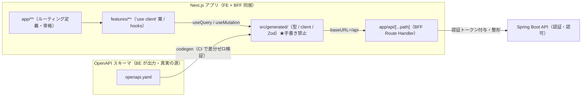

# FE アーキテクチャ設計書

> 本書は FE（Next.js のブラウザ側 ＋ BFF）の実装アーキテクチャと規約を定める。
> **意思決定の根拠は [ADR 0001〜0005](../ADR/README.md) が正**であり、本書はそれを実装に落とすための投影である。ADR と本書が食い違う場合は ADR を優先する。

対象は **基幹システムのマスタデータ管理サイト（一覧 / 詳細 / マスタ更新の CRUD・4〜5画面）**。フロント専任 1 名 ＋ AI コーディングエージェント主体で開発し、判断ポイントを規約と機械ゲートで縛る。

---

## 0. 前提（ADR からの継承）

本書は以下を所与とする（再決定しない）。

| 継承する決定 | 出典 |
|---|---|
| **Next.js（App Router）＋ クライアントファースト**。RSC は主役にしない | ADR-0001 |
| FE/BFF を 1 つの Next.js アプリに同居。BFF は Route Handler（`app/api/**/route.ts`） | ADR-0001 |
| サーバー状態は **TanStack Query** に統一（`useQuery`/`useMutation`） | ADR-0002 |
| クライアント状態は素朴に（コンポーネント state、必要なら軽量手段） | ADR-0002 |
| **Server Actions を使わない**。サーバー処理は Route Handler に集約 | ADR-0001 / 0002 |
| 型・API クライアント・Zod は **OpenAPI から自動生成**。手書き型禁止 | ADR-0003 |
| 規約は **AGENTS.md ＋ lint / 型 / CI** で機械的に強制 | ADR-0004 |
| テストは **Vitest + RTL（単体/コンポーネント）＋ Playwright（E2E）** | ADR-0005 |

FE の存在意義を一文で言うと、**「OpenAPI から生成した型・client を土台に、メンタルモデルを『API を叩くクライアントアプリ』へ固定し、サーバー状態は TanStack Query に預け、正しさを機械ゲートで落とす」**。

---

## 1. FE 全体像



要点:

- ブラウザは **BE の URL もトークンも知らない**。`useQuery`/`useMutation` は同一オリジン `/api`（BFF）だけを叩く。
- FE は型・client を手書きしない。**すべて OpenAPI から生成**し `src/generated/` に隔離する（ADR-0003）。
- BFF（Route Handler）が認証トークン付与・ヘッダ整形・API アグリゲーションを担う（ADR-0001）。

---

## 2. ディレクトリ構成とコロケーション

単一 Next.js アプリ。`app/` はルーティング定義のみ、実体は機能単位（feature）に凝集する。

```
src/
├─ app/                        # App Router＝ルーティング定義のみ（ロジックを書かない）
│  ├─ layout.tsx               # 骨格。providers を呼ぶだけ
│  ├─ providers.tsx            # 'use client'：QueryClientProvider
│  ├─ api/[...path]/route.ts   # BFF キャッチオール proxy（認証付与・整形）
│  └─ masters/
│     ├─ page.tsx              # マスタ一覧
│     └─ [masterType]/
│        ├─ page.tsx           # レコード一覧 / 検索
│        └─ [recordId]/page.tsx# 詳細・更新
├─ features/                   # ★機能単位で凝集（Colocation）
│  └─ master/
│     ├─ components/           # 'use client' 葉（一覧・検索・テーブル・フォーム）
│     ├─ hooks/                # useXxxState=useQuery / useXxxAction=useMutation
│     └─ types/
├─ components/ui/              # 横断 UI 部品（自前デザインシステム・§7）
├─ lib/                        # 横断ユーティリティ（error / i18n / 整形）
└─ generated/                  # ★OpenAPI 生成物（型 / client / Zod）。手で編集しない
```

### 配置規約

- **`app/` はルーティング定義のみ**。page/layout は `features/` から import して組み立てる枠に徹し、UI・ロジックの実体を持たない。
- **実体は `features/{機能}/` に機能単位で凝集**（Colocation）。`components` / `hooks` / `types` を機能フォルダ内に同居させる。
- **横断共通 UI は `components/ui/`、横断ロジックは `lib/`**。機能固有のものは `features/` から出さない。
- **マスタ別フォルダ（`features/master/product/` 等）を作らない**。マスタは `app/masters/[masterType]` の動的セグメント 1 セットで捌く。
- 具体的な命名・粒度テンプレートは `docs/conventions/` に置く（ADR-0004）。

---

## 3. レイヤーと依存方向

```
UI（components/ui・features 内の葉コンポーネント）
      ↓ 参照のみ・直 fetch 禁止
Logic（features 内の useXxxState=useQuery / useXxxAction=useMutation）
      ↓
Data（src/generated の api-client → BFF Route Handler → BE）
```

- 依存は **UI → Logic → Data の一方向**。逆流禁止。
- **UI から直接 `fetch` しない**。読み取りは `useXxxState`、書き込みは `useXxxAction` を必ず経由（ESLint `no-restricted-globals` / `no-restricted-syntax`・ADR-0004）。
- **生成物（`src/generated/`）の手書き改変禁止**（再生成で上書き・ADR-0003）。import 経路も lint で固定する。

---

## 4. データ取得層（TanStack Query・ADR-0002）

### 4.1 状態の分担

| 状態種別 | 持ち手 | 例 |
|---|---|---|
| **サーバー状態**（API 由来） | **TanStack Query** | マスタ一覧、レコード一覧、レコード詳細 |
| **クライアント UI 状態**（画面に閉じる） | コンポーネント state（必要なら軽量手段） | ドロワー開閉、選択行、一時フラグ |
| **URL 状態**（ブックマーク可能にしたい座標） | `searchParams` / 動的セグメント | `masterType`、`recordId`、検索クエリ、ページ |

サーバーデータを `useState` にコピーして手動再取得する設計は採らない。取得→キャッシュ→無効化の宣言的ループ（`invalidateQueries`）に置き換える。

### 4.2 read/write の責務分離

| 命名 | 実体 | 責務 |
|---|---|---|
| `useXxxState()` | `useQuery` ラッパー | 読み取り専用 |
| `useXxxAction()` | `useMutation` ＋ `invalidateQueries` | 書き込み＋キャッシュ無効化＋エラーハンドリング |

これらの画面固有フックは feature の `hooks/` に置く（例: `features/master/hooks/`）。

```ts
// features/master/hooks/useMasterRecords.ts
export function useMasterRecordsState(masterType: string, q: RecordQuery) {
  return useQuery({
    queryKey: keys.list(masterType, q),
    queryFn: () => api.listRecords(masterType, q),   // src/generated の生成 client
    enabled: !!masterType,
  })
}

export function useUpsertMasterRecordAction(masterType: string) {
  const qc = useQueryClient()
  return useMutation({
    mutationFn: (input: RecordInput) => api.upsertRecord(masterType, input),
    onSuccess: () => qc.invalidateQueries({ queryKey: keys.all(masterType) }),
  })
}
```

### 4.3 queryKey 規約（ADR-0002）

queryKey の文字列直書きを禁止し、ファクトリに集約する。構造を固定し無効化を機械的にする。

```ts
export const keys = {
  all:    (masterType: string)               => ['masters', masterType] as const,
  list:   (masterType: string, q: RecordQuery)=> [...keys.all(masterType), 'list', q] as const,
  detail: (masterType: string, id: string)   => [...keys.all(masterType), 'detail', id] as const,
}
```

- 更新成功時は **マスタ単位でまとめて無効化**（`invalidateQueries({ queryKey: keys.all(masterType) })`）。個別最適化は必要になってから。

### 4.4 取得モード（クライアント取得が基本）

| モード | 構成 | 既定 |
|---|---|---|
| **A：クライアント取得** | 葉で `useQuery`。初回はスケルトン→取得 | **これを基本**（ADR-0002） |
| **B：SSR プリフェッチ** | Server の page で `prefetchQuery`→`dehydrate`→`HydrationBoundary`、葉は普通に `useQuery` | 初回表示性能が要件化した画面のみ・加算的に導入 |

最初から全画面 SSR にしない。モード B は `initialData` のバケツリレーではなく `HydrationBoundary` を使う。

### 4.5 QueryClient ファクトリ（落とすと重大バグ）

**サーバーは毎リクエスト新規・クライアントは singleton**。サーバーで使い回すとリクエスト間でキャッシュが混ざりユーザー間データ漏洩になる。

```ts
function makeClient() { return new QueryClient({ defaultOptions: { queries: { staleTime: STALE.default } } }) }
let browserClient: QueryClient | undefined
export function getServerQueryClient()  { return makeClient() }                       // 毎回 new
export function getBrowserQueryClient() { return (browserClient ??= makeClient()) }   // singleton
```

Provider は `'use client'` な `app/providers.tsx` に置き、Server の `app/layout.tsx` から呼ぶ。

### 4.6 楽観的更新

初期は導入しない。UX 要件が出てから画面単位で `onMutate`（先行書き換え）/ `onError`（ロールバック）/ `onSettled`（再検証）を足す（ADR-0002）。

---

## 5. コード生成（OpenAPI・ADR-0003）

- **OpenAPI スキーマを真実の源**とし、型・API クライアント・Zod スキーマを自動生成する。手書きの API 型は禁止。

| 生成対象 | ツール例（確定は実装着手時） |
|---|---|
| 型定義 | `openapi-typescript` |
| API クライアント（型付き fetch） | `openapi-fetch` |
| バリデーション Zod | `openapi-zod-client` 等 |

- 生成物は `src/generated/` に隔離し、人も AI も手で編集しない（再生成で上書き）。生成 client の **baseURL は `/api`**（同一オリジン・BFF）。
- CI で「再生成結果 == コミット済み生成物」を検証（drift 検出）。スキーマ変更の影響は型エラーで表面化する。
- ドメイン型は camelCase で扱う。BE snake_case ⇄ FE camelCase の変換は境界で吸収（生成時 camelCase 化 / 境界変換のいずれか・実装着手時に確定）。

---

## 6. Server/Client 境界（ADR-0001）

メンタルモデルは **「API を叩くクライアントアプリ」**。`'use client'` は葉に押し下げる。

| 部位 | 境界 | 理由 |
|---|---|---|
| `app/layout.tsx` / `app/**/page.tsx`（ルート定義・骨格） | Server のまま可 | 静的構造。ルーティングの枠 |
| `app/providers.tsx`（QueryClient Provider） | **Client** | フック・Context が必要。layout から呼ぶ |
| `features/**` の操作・表示部品 | **Client** | 状態・イベント・`useQuery`/`useMutation` を持つ |

**Server Actions を使わない**（ADR-0001 / 0002 / 0004）。書き込みは TanStack mutation → BFF Route Handler → BE に一本化する。理由:

- BFF が既に書き込み経路。Server Actions を足すと経路が二重化し認証の通り道も割れる。
- 契約（OpenAPI）を通らない RPC を増やさない。`features/` 配下に `actions/`（Server Actions）を設けない。

`'use server'` の使用は ESLint で禁止（ADR-0004）。

---

## 7. UI 層・フォーム

- **横断 UI 部品は `components/ui/`、機能固有 UI は各 feature の `components/`**。汎用部品はビジネスロジックを持たない。
- スタイリングは Tailwind に一本化。arbitrary value（`w-[137px]` 等）は原則禁止・ESLint 検出。
- UI は 1 単位ずつ切り、状態（hover / focus / disabled / loading / empty / error）を網羅する。ローディング/エラーは TanStack の `isPending`/`isError` を用いる。
- **フォームは React Hook Form + Zod**（ADR-0004）。バリデーション Zod は更新 API のリクエスト型と整合させる（生成 Zod を使うか、手書き Zod を生成型に合わせる・ADR-0003）。
- クライアントエラーはフィールド直下にインライン、サーバーエラーは画面レベル通知（§9）。

> **発展的アプローチ（任意・未 ADR 化）**: 将来マスタ種別が増え 4〜5 画面で捌けなくなった場合、メタ定義（項目定義）から一覧/詳細/更新画面を実行時に組む「定義駆動 UI」を検討余地として残す。ただし現状の画面規模では過剰なため**本設計では採用しない**。採用する場合は ADR を追加してからにする。

---

## 8. テスト戦略（ADR-0005）

判定は「人が読んで確認」ではなく「機械が落とす / 自動テストが通る」。網羅率より、AI のドリフトとリグレッションを止める検証ゲートとしての費用対効果を重視する。

| 層 | ツール | 対象 |
|---|---|---|
| 単体 / コンポーネント | **Vitest + React Testing Library**（`jsdom`） | ロジック、Zod スキーマ、フォームのバリデーション挙動、一覧のフィルタ/ソート |
| E2E | **Playwright**（本番ビルドに対して実行） | 各マスタの「一覧→詳細→更新→一覧へ反映」ハッピーパス |

- ロケータは `getByRole` / `getByLabel` 等の意味ベースを優先。
- **API モック**: 単体は生成 API クライアントをモック、E2E は Playwright のリクエスト傍受でレスポンスをモックし決定的にする。モックのレスポンス型は生成型（ADR-0003）に整合させ契約のズレを型で検出。
- **当面追わない**: ビジュアルリグレッション（flaky）、CSS/レイアウトの厳密検証、網羅率の数値目標。
- テスト価値の本体は純粋ロジック（整形・パラメータ組み立て・バリデーション）。`isPending` 遷移・`staleTime` などライブラリ責務はテストしない。

---

## 9. エラーハンドリング・横断（FE 側）

| 関心事 | FE 方針 |
|---|---|
| エラー構造化 | 共通 `ErrorResponse` を `ApiError` で構造化し、TanStack の `onError` 経由で一元ハンドリング。土台は `lib/error` |
| 個別エラー画面 | 作らない。共通の枠（`error.tsx`）で受ける |
| 認証・認可 | **FE は認可を書かない**。401/403 は再ログイン誘導・編集中データ保護で扱う。認証/トークン周りの変更は人間主導（ADR-0004） |
| 秘匿情報 | トークン・IdP シークレットは BFF（サーバー側）に閉じる。ブラウザに出さない |
| 文言 | 文言外出し（メッセージカタログ＋ESLint `no-literal-string`）。多言語は基本不要 |
| ログ/監視 | FE は RUM、相関 ID は BE 発番を透過 |

---

## 10. FE に効く機械ゲート（ADR-0004）

| 守りたいこと | 強制手段 | タイミング |
|---|---|---|
| 契約⇔コードのドリフト・生成物手書き改変 | codegen の drift 検出（再生成して `git diff --exit-code`） | 編集後 / CI |
| 契約破壊が消費コードを止める | `tsc --noEmit`（strict） | コミット前 / CI |
| クライアント直 fetch 禁止（取得は生成 client + TanStack 経由） | ESLint（`no-restricted-globals` / `-syntax`） | 編集後 / CI |
| `src/generated/` の import 経路固定・手書き禁止 | ESLint（`no-restricted-imports`） | 編集後 / CI |
| Server Actions を使わない（`'use server'` 禁止） | ESLint ＋ レビュー | 編集後 / CI |
| `app/` にロジックを書かない（ルート定義のみ） | レビュー（必要なら dependency-cruiser） | 編集後 / CI |
| Rules of Hooks・不要 useEffect | eslint-plugin-react-hooks | 編集後 / CI |
| デザイントークン逸脱（任意値）禁止 | ESLint（Tailwind arbitrary value 検出） | 編集後 / CI |
| 文言ハードコード禁止 | ESLint（`no-literal-string`） | 編集後 / CI |
| 振る舞い / E2E | Vitest + RTL / Playwright（CI ゲート・通過しない PR はマージ不可） | CI |

- 規約は `AGENTS.md`（`CLAUDE.md` から `@` インポート）に明文化し、lint / 型 / CI と二重化する（文章は説明、強制は機械・ADR-0004）。

---

## 11. FE 残論点（勝手に確定させない）

| 残論点 | 状態 |
|---|---|
| codegen ツールの確定（型 / client / Zod） | 実装着手時に最新の保守状況を見て確定。原則（生成・手書き禁止）は不変 |
| ケース変換（生成時 camelCase / 境界変換） | 未決。ドメイン型 camelCase のみ確定 |
| `staleTime`/`gcTime` 具体値、モード B を入れる画面の基準 | 未決。定数に集約し直書きしない |
| 401/403 の UI 挙動 | 残論点 |
| 楽観的更新を入れる画面 | UX 要件が出てから画面単位で判断 |
| 定義駆動 UI の採用（§7 発展的アプローチ） | 不採用。必要化したら ADR を追加して再検討 |
| クライアント状態の手段（コンポーネント state / Zustand 等） | 必要になった時点で軽量手段を選定 |
