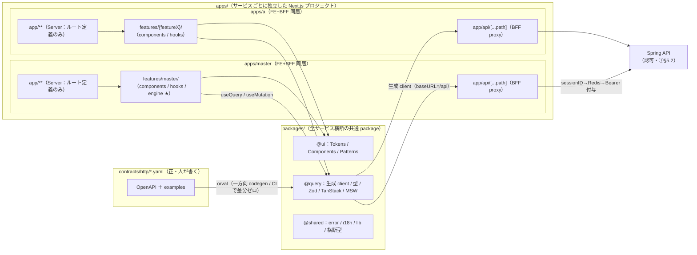

# 10-FE.md ─ FE アーキテクチャ設計書

> 本書は全体基本設計書（①`設計最新.md`）の **FE 詳細（②）** である。横断事項（契約駆動・モノレポ境界・認証境界・機械ゲートの全体像・ADR）は①に寄せ、本書は重複させず参照する。本書が定義するのは **FE（TS 世界・Next.js 15 App Router のブラウザ側＋共通 package）の実装アーキテクチャと規約** に限る。BFF は 30-BFF.md、BE は 20-BE.md。マスタサービスのメタ定義駆動エンジンの**実装詳細は 10-FE-master-engine.md** に分離した（本書 §6 はその決定のみを扱う）。
>
> 本書は旧 10-FE.md（React/Vite・サーバーキャッシュ層なし前提）を、①の **Next.js（FE+BFF）＋ TanStack Query ＋ サービス分割モノレポ** 方針へ全面改訂した版である。一次情報は①および nextアーキテクチャ検討.md・FE知見共有会.md・UI開発の考え方.md・FE配信_認証.md。
>
> **本改訂（Feature-based Architecture 版）**: 全体の構成原理を **「機能単位（Features）＋ Colocation」** に統一した。サービスは `apps/{service}/` の**独立した Next.js プロジェクト**として並べ、各サービス内は `app/`＝ルート定義のみ・実体は `features/` に凝集する。複数サービス横断で共有するもののみ `packages/`（`@ui`/`@query`/`@shared`）に置く。これに伴い旧版で `@shared/master-engine` として「全体共通」に出していたメタ定義駆動エンジンは、**マスタサービスに閉じた純粋関数層**であるため `apps/master/.../features/master/engine/` へ移設する。

---

## 0. 前提と一次方針（①からの継承）

本書は①の以下を所与とする（再決定しない）。根拠 ADR は①§10。

| 継承する決定 | 出典 |
|---|---|
| Next.js 15 App Router（ファイルベースルーティング）。最低 15.2.3 | ADR-0013 |
| FE+BFF を1つの Next.js アプリに同居、サービスごとに独立配信 | ADR-0014 |
| サーバー状態 = TanStack Query / クライアント UI 状態 = Jotai | ADR-0015 |
| Server/Client 境界: 骨格・layout は Server、操作の葉だけ Client。契約境界で Server Actions を使わない | ADR-0016 |
| 共通 UI は Atomic Design を採らず役割3層。Tailwind トークン固定、任意値禁止 | ADR-0017 |
| マスタ個別の画面コード・マスタ別フォルダを作らない（メタ定義駆動） | ADR-0003 |
| 認可判定は BE Service 層のみ。FE は認可を書かない | ADR-0008 |
| 契約 `contracts/` が一次情報。生成物の手書き改変禁止 | ADR-0002 / 0009 |

FE の存在意義を一文で言うと、**「契約から生成した型・client・hooks・mock を土台に、各サービスを機能単位（feature）で凝集させ、マスタサービスではメタ定義からマスタ画面を組み、サーバー状態は TanStack Query に、UI 状態は Jotai に預け、正しさを機械ゲートで落とす」**。

### 0.1 本改訂で確定した構成原理（Feature-based Architecture）

旧版が `apps/app`（単一アプリ）＋ `packages/` を前提にしていたのに対し、本改訂は以下を構成原理として確定する。

- **サービス＝独立 Next.js プロジェクト**。`apps/{master, a, b, ...}/` を並べる（①「複数アプリ表現」残論点を **サービス分割（複数プロジェクト）** で確定。route group での同居は採らない）。
- **サービス内は Feature-based**。`app/` は**ルーティング定義のみ**（ロジックを書かない）。実体は同サービスの `features/` 配下に機能単位で凝集（Colocation）。
- **共有の判定基準は「使用範囲」**。複数サービスで使う土台だけを `packages/`（`@ui`/`@query`/`@shared`）に昇格。1サービスに閉じるものはそのサービスの `features/` 内に置き、`packages/` に上げない。
- **feature 間の相互依存禁止**。あるサービス内の feature が別 feature を直接 import しない。共通化が要るものは `packages/` か、サービス内の共有層（後述 `_shared/`）へ逃がし、依存を一方向に保つ（dependency-cruiser で機械強制）。

> 註: この構成原理は Next.js App Router の実務 Feature-based 構成（`app/`＝ルート定義のみ／`features/`＝機能凝集／汎用は外出し）を、本プロジェクトの **モノレポ・複数サービス・契約駆動** という制約に合わせて拡張したものである。元記事が主軸に置く「RSC ファースト（page トップで fetch して props で配る）」は本書では**採らない**（取得は TanStack Query 経由・モードA基本。§4・§5.2 参照）。採るのは Feature-based の凝集原理の方である。

---

## 1. FE 全体像



要点（①§3・§5 の FE 側投影）:

- ブラウザは **BE の URL もトークンも知らない**。`useQuery`/`useMutation` は同一オリジン `/api`（各サービスの BFF proxy）だけを叩く。
- FE は独自の型・client を手書きしない。**すべて契約から生成**し、横断共通の `@query`（`packages/`）に集約する。
- 各サービスは **feature 単位で凝集**する。マスタサービスのマスタ画面は個別実装せず、**メタ定義 → 純粋関数（`features/master/engine/`）→ `@ui` 部品**で組み上げる。`engine/` は全体共通ではなく**マスタサービスに閉じた共通**である。

---

## 2. ディレクトリ構成とコロケーション

①§3.1 のモノレポのうち、FE が触れる範囲を Feature-based Architecture で詳細化する。

```
apps/                              # サービスごとに独立した Next.js プロジェクトを並べる
├─ master/                         # @app/master（マスタサービス・レスポンシブで PC/モバイル両対応）
│  └─ src/
│     ├─ app/                      # App Router＝ルーティング定義のみ（ロジックを書かない）
│     │  ├─ layout.tsx             # Server：骨格。Providers（'use client'）を呼ぶだけ
│     │  ├─ providers.tsx          # 'use client'：QueryClientProvider / Jotai Provider 等
│     │  ├─ api/[...path]/route.ts # BFF キャッチオール proxy（30-BFF.md）
│     │  └─ masters/
│     │     ├─ page.tsx            # Server：features/master を呼び出すだけ
│     │     └─ [masterId]/
│     │        ├─ page.tsx
│     │        ├─ import/page.tsx
│     │        └─ [recordId]/page.tsx
│     └─ features/                 # ★このサービスの機能をここに凝集（Colocation）
│        └─ master/                # マスタ機能
│           ├─ components/         # 'use client' 葉（一覧・タブ・検索・テーブル・ページャ）
│           ├─ hooks/              # useXxxState=useQuery / useXxxAction=useMutation
│           ├─ engine/             # ★メタ定義→UI の純粋関数（旧 @shared/master-engine。§6・実装詳細は 10-FE-master-engine.md）
│           └─ types/              # マスタ機能に閉じた型
│
├─ a/                              # @app/a（サービスA）― 同じ規約を踏襲
│  └─ src/
│     ├─ app/                      # ルート定義のみ
│     │  ├─ providers.tsx
│     │  └─ api/[...path]/route.ts # サービスA の BFF proxy
│     └─ features/
│        ├─ {featureX}/            # components / hooks / types
│        └─ _shared/               # サービスA 内の複数 feature 共有（packages 昇格前の中間置き場）
│
└─ b/                              # @app/b（サービスB）― 同上

packages/                          # ★複数サービス横断で使うものだけをここに置く
├─ ui/                             # @ui（§7）
├─ query/                          # @query（§4）：orval 生成物 ＋ TanStack ラッパー ＋ MSW
└─ shared/                         # @shared（§3）
   └─ error/  i18n/  lib/  types/  # 横断の error / i18n / lib / 型のみ（engine はここに置かない）
```

### 配置規約（ADR-0003・①「やってはいけないこと」・Feature-based）

- **`app/` はルーティング定義のみ**。page/layout は同サービスの `features/` から import して組み立てる枠に徹し、UI・ロジックの実体は持たない。
- **実体は `features/{機能}/` に機能単位で凝集**する（Colocation）。`components` / `hooks` / `types`、マスタなら `engine` を機能フォルダ内に同居させる。
- **`packages/` への昇格基準は「複数サービスで使うか」**。
  - 1サービス・1 feature に閉じる → その feature 配下（`features/{機能}/components` 等）。
  - 同一サービス内の複数 feature 共有 → そのサービスの `features/_shared/`（中間置き場。肥大したら `packages/` 昇格を検討）。
  - **複数サービス共有 → `@ui` / `@query` / `@shared`**（`packages/`）。
- **サービス内に「種類別の共有置き場（`components/` / `dialogs/` / `hooks/` をサービス直下に）」を新設しない**。種類で割らず機能（feature）で割る。横断共通は `packages/` が唯一の昇格先。
- **マスタ別フォルダ（`features/master/department/` 等）を作らない**。マスタは `app/masters/[masterId]` 動的セグメント1セット＋ `features/master` のメタ定義駆動で捌き、マスタ追加はデータ追加（コード追加ゼロ）。
- **feature 間の直接 import 禁止**（相互依存を作らない）。共通化が要るものは上の昇格基準に従って外へ逃がし、依存を一方向に保つ（dependency-cruiser / import/no-restricted-paths で機械強制・①§6・§10）。

> **master-engine の所在（本改訂の要点）**: メタ定義駆動エンジンは**マスタサービスでしか使わない**ため、横断共通の `@shared` ではなく **`apps/master/src/features/master/engine/`** に置く。これは「共通＝全体共通」ではなく「マスタサービス内の共通（純粋関数層）」である、という本改訂の整理を体現する。将来別サービスが同じメタ駆動を必要とした場合に初めて `packages/` への昇格を検討する（先に上げない）。

> **残論点（①§10）**: feature 内のさらに細かい粒度（`components`/`hooks` のサブ構造、`_shared/` を設けるか feature をフラットに保つか）は運用で詰める。本書は上記を仮置きとする。

---

## 3. レイヤーと依存方向

```
UI（@ui 部品 / features 内の葉コンポーネント）
      ↓ 参照のみ・直 fetch 禁止
Logic（features 内の useXxxState=useQuery / useXxxAction=useMutation / 純粋関数 engine）
      ↓
Data（@query：生成 api-client → 各サービスの BFF proxy → BE）
```

- 依存は **UI → Logic → Data の一方向**。逆流禁止（dependency-cruiser で機械強制・①§6）。
- **UI から直接 `fetch` しない**。読み取りは `useXxxState`、書き込みは `useXxxAction` を必ず経由（ESLint `no-restricted-globals`）。
- **feature 境界も一方向**: `app/`（ルート）→ `features/`（機能）→ `packages/`（横断共通）。逆流・横断（feature 同士の直接参照、`packages` から `apps` 参照）を禁止（`import/no-restricted-paths`）。
- **サービス間の直接 import 禁止**。`apps/a` から `apps/b` を直接参照しない。共有は必ず `packages/` を経由する。
- **生成物（`@query` の `generated/` 等）の手書き改変禁止**（再生成で上書き・ADR-0009）。

---

## 4. データ取得層（TanStack Query）

### 4.1 状態の二分（ADR-0015）

| 状態種別 | 持ち手 | 例 |
|---|---|---|
| **サーバー状態**（API 由来） | **TanStack Query** | マスタ定義、レコード一覧、レコード詳細 |
| **クライアント UI 状態**（画面に閉じる） | **Jotai**（・`useState`） | タブ選択、ドロワー開閉、選択行、一時フラグ |
| **URL 状態**（ブックマーク可能にしたい座標） | `searchParams` / 動的セグメント | `masterId`、`recordId`、検索クエリ、ページ |

「状態は全部 Jotai」（旧 SPA 方針）は**明確に縮小**する。サーバーデータを `useState`/atom にコピーして手動再取得する設計は廃し、取得→キャッシュ→無効化の宣言的ループ（`invalidateQueries`）に置き換える。

TanStack 関連の hooks・queryKey ファクトリ・QueryClient ファクトリ等の**土台は横断共通 `@query`（`packages/`）に置く**。各サービスの feature 内 hooks（`features/{機能}/hooks/`）は、それを使って画面固有の `useXxxState`/`useXxxAction` を組む。

### 4.2 read/write の責務分離（SPA 規約の継承）

| 命名 | 実体 | 責務 |
|---|---|---|
| `useXxxState()` | `useQuery` ラッパー | 読み取り専用。再レンダリングは該当データ変更時のみ |
| `useXxxAction()` | `useMutation` ＋ `invalidateQueries` | 書き込み＋キャッシュ無効化＋エラーハンドリング |

これらの画面固有フックは、それを使う feature の `hooks/` に置く（例: `apps/master/src/features/master/hooks/`）。

```ts
// apps/master/src/features/master/hooks/useMasterRecords.ts
// 読み取り
export function useMasterRecordsState(masterId: string, q: RecordQuery) {
  return useQuery({
    queryKey: keys.records(masterId, q),
    queryFn: () => api.listRecords(masterId, q),
    enabled: !!masterId,            // 早撃ち防止（id 未確定で投げない）
    staleTime: STALE.records,       // §4.6
  })
}

// 書き込み
export function useUpsertMasterRecordAction(masterId: string) {
  const qc = useQueryClient()
  return useMutation({
    mutationFn: (input: RecordInput) => api.upsertRecord(masterId, input),
    onSuccess: () => qc.invalidateQueries({ queryKey: keys.all(masterId) }),
  })
}
```

### 4.3 queryKey ファクトリ（規約を破れなくする）

queryKey の文字列直書きを禁止し、ファクトリに集約する。ファクトリは横断共通 `@query` に置き、各サービスはそれを使う。タブ（masterId）を必ず含め、検索条件は正規化純粋関数を通す。

```ts
// @query/keys.ts（packages/query）
export const keys = {
  all: (masterId: string) => ['masters', masterId] as const,
  definition: (masterId: string) => [...keys.all(masterId), 'definition'] as const,
  records: (masterId: string, q: RecordQuery) =>
    [...keys.all(masterId), 'records', normalizeSearch(q)] as const,   // 正規化（§6）
  record: (masterId: string, recordId: string) =>
    [...keys.all(masterId), 'record', recordId] as const,
}
```

- キーは配列・階層的・パラメータ必須。
- `invalidateQueries` は**影響範囲のキーだけ**を対象にする（無関係なマスタを無効化しない）。一覧と詳細の両方に効く操作は両キーを明示的に無効化する。

### 4.4 取得モード（モードA基本 / モードB部分昇格）

①§7「データ取得モード」を FE 実装に落とす。**両モードを同一画面で混線させない**。本書は元記事の「RSC ファースト（page トップで fetch して props バケツリレー）」は採らず、取得は TanStack Query に一本化する点に注意。

| モード | 構成 | 既定 | 適用 |
|---|---|---|---|
| **A：純クライアント取得** | feature の葉で `useQuery` のみ。初回はスケルトン→取得 | **これを基本** | 認証付き内部ツールで SEO 不要。今の SPA と同じ体感 |
| **B：prefetch + hydrate** | Server の page で `prefetchQuery`→`dehydrate`→`HydrationBoundary`、葉は普通に `useQuery` | 例外 | 初回ちらつきが実測で問題になる着地画面のみ |

モードB は `initialData` プロップのバケツリレーではなく `HydrationBoundary` を使う（タブ×ページ×検索で queryKey が分岐するため）。

```tsx
// apps/master/src/app/masters/[masterId]/page.tsx（Server）― モードB のときだけ
export default async function Page({ params }: { params: { masterId: string } }) {
  const qc = getServerQueryClient()                 // ★リクエスト毎に new（§4.5）
  await qc.prefetchQuery({
    queryKey: keys.records(params.masterId, { page: 1 }),
    queryFn: () => api.listRecords(params.masterId, { page: 1 }),
  })
  return (
    <HydrationBoundary state={dehydrate(qc)}>
      {/* features/master の葉。'use client'：useQuery するだけ */}
      <MasterRecordView masterId={params.masterId} />
    </HydrationBoundary>
  )
}
```

**着手順**: まず全画面をモードA で組み、エンジン（§6）とフックを固める。モードB は加算的変更なので、ちらつきが問題化した画面に後から被せる。最初から全画面 RSC 取得にしない。

### 4.5 QueryClient ファクトリ（落とすと重大バグ）

**サーバーは毎リクエスト新規・クライアントは singleton**（①§6）。サーバーで使い回すと**リクエスト間でキャッシュが混ざりユーザー間データ漏洩**になる。ファクトリは `@query` に置き、各サービスが共用する。

```ts
// @query/queryClient.ts（packages/query）
function makeClient() { return new QueryClient({ defaultOptions: { queries: { staleTime: STALE.default } } }) }

let browserClient: QueryClient | undefined
export function getServerQueryClient() { return makeClient() }              // 毎回 new
export function getBrowserQueryClient() { return (browserClient ??= makeClient()) } // singleton
```

Provider は各サービスの `'use client'` な `app/providers.tsx` に置き、Server の `app/layout.tsx` から呼ぶ（layout 自体に `'use client'` を付けない）。

### 4.6 staleTime / gcTime と楽観的更新

- 既定: **マスタ系（定義）は長め / 基幹データ（レコード）は短め**。具体値は残論点（①§10）。`STALE` 定数（`@query`）に集約し直書きしない。
- 楽観的更新は `onMutate` でキャッシュを先行書き換え、`onError` でロールバック、`onSettled` で再検証。分岐のあるものに限り、ロールバック分岐はフックテストの対象（§8）。

### 4.7 orval / ケース変換

- orval で OpenAPI → `useQuery`/`useMutation` hooks・型・Zod・MSW ハンドラを生成。生成物は `@query`（横断共通）に集約。生成 client の **baseURL は `/api`**（各サービスの BFF proxy。同一オリジン）。
- ケース変換（BE snake_case ⇄ FE camelCase）は **残論点**（①§4.2）。生成時 camelCase 化 / 境界で `camelcase-keys` / BE が camelCase 出力、のいずれか。ドメイン型は camelCase で扱う、までは確定。

---

## 5. Server/Client 境界（ADR-0016）

### 5.1 線引きの原則

`'use client'` は**葉に押し下げる**。`page.tsx`/`layout.tsx`（ルート定義）は Server のまま保ち、操作・インタラクティブ表示の feature コンポーネントだけ Client にする。

| 部位 | 境界 | 理由 |
|---|---|---|
| `app/layout.tsx` / `app/**/page.tsx`（ルート定義・骨格） | **Server** | 静的構造。`'use client'` を付けない（ESLint 境界ルール） |
| `app/providers.tsx`（QueryClient/Jotai Provider） | **Client** | フック・Context が必要。layout から呼ぶ |
| `features/**` の Overlay / TextInput / Selection 系部品 | **Client** | 状態・イベントを持つ |
| `features/**` / `@ui` の Layout / Display 系部品（静的表示） | **Server** 可 | 状態を持たない |
| `features/**/hooks` で `useQuery`/`useMutation` を使う葉 | **Client** | TanStack はクライアント |

### 5.2 Server Actions を使わない（契約境界）

書き込みは **TanStack mutation → BFF proxy → BE** に一本化する。元記事は Server Actions を `features/**/actions/` に置く前提だが、本書は**契約境界で Server Actions を使わない**（①§6・ADR-0016）。そのため `features/` 配下に `actions/`（Server Actions）ディレクトリは設けない。理由:

- BFF（Route Handler）が既に書き込み経路。Server Actions を足すと**経路が二重化**し認証の通り道も割れる。
- design-first・examples 由来 MSW・codegen:check の統制内に保つため、契約を通らない RPC を増やさない。
- Server Actions の旨味（プログレッシブエンハンス・`revalidatePath`）は、JS 必須の内部ツール＋TanStack がキャッシュを持つ本構成では効かない。

`'use server'` の使用箇所は ESLint で制限（①§6）。

---

## 6. メタ定義駆動 UI エンジン（ADR-0003）＝ マスタサービスの構造決定

> 本節は**アーキテクチャ決定**（変更が他モジュール・契約境界・テスト戦略に波及するもの）に限る。ファイル分割・関数シグネチャ・コード例といった**マスタサービス内に閉じる実装詳細は 10-FE-master-engine.md** に分離した。設計レビューでの確定対象は本節、実装着手後に更新するのは別書、という粒度で分けている。

マスタ定義（メタデータ）から画面を実行時に組む。マスタ画面を個別実装せず、**「定義 → UI」を担う純粋関数を `apps/master/src/features/master/engine/` に集約**し、データ取得から完全に切り離す。これは ADR-0003「マスタ別フォルダ・マスタ別画面コードを作らない」の実体であり、「マスタ追加＝データ追加（コード追加ゼロ）」というマスタサービスの構造そのものを規定する決定である。この層が①§8 V-5 の本体であり、テスト価値の中心（§8）でもある。

本節で確定する4つの決定は以下。いずれも変更すると依存方向・ディレクトリ構成・テスト戦略に波及する。

### 6.1 決定1: エンジンの所在 ＝ マスタサービス内（横断共通に出さない）

このエンジンは**マスタサービスでのみ使う共通**であり、全サービス横断の共通ではない。よって横断共通の `@shared`（`packages/`）ではなく、マスタサービスの feature 配下（`features/master/engine/`）に置く。Feature-based の「機能に閉じたものは機能の中へ」（§2 の昇格基準）を体現する配置である。将来、別サービスが同じメタ駆動を必要としたときに初めて `packages/` 昇格を検討する（先に上げない）。

この所在は依存方向にも効く: エンジンは `@ui`（横断共通）を参照するが、`@ui` はエンジンを参照しない（一方向・§3）。

### 6.2 決定2: 1定義から4画面を導出する（個別画面を作らない）

マスタ一覧・レコード一覧/検索・メンテ・CSV 取込の4画面を、同一の項目定義から導出する。画面ごとにコードを書かない。導出は `app/masters/**`（ルート定義）＋ `features/master`（実体）で構成する。どの画面が定義のどの属性を使うか、どの導出関数に対応するかは 10-FE-master-engine.md §3。

### 6.3 決定3: エスケープハッチを2層で持つ（100%定義駆動にしない）

100% 定義駆動は「この項目だけ特殊」で必ず詰まる。最初から **registry による自動生成（大半）＋ 名指しオーバーライド（少数）** の2層で設計する、という方針を構造として固定する。バリデーションも、単項目は定義から自動生成、相関バリデーション（項目間整合）は名指しコードに逃す、という線引きを採る（定義スキーマの肥大を防ぐため）。比率の目安や `overrides` の具体形は 10-FE-master-engine.md §4。

### 6.4 決定4: 「定義こそが実行時の型」という割り切り

レコード本体は `Record<fieldKey, value>` で**静的型はつかない**。これはメタ定義駆動の本質的な代償で回避不能であり、**チームで明示合意すべきアーキテクチャ上のトレードオフ**である（後から型をつける方向へ覆すと設計全体に波及するため）。orval 生成型は封筒（envelope・ページング・エラー）までを担い、レコード本体の保証は実行時 Zod で行う、という責務分担で受ける。実装側の詳細は 10-FE-master-engine.md §5。

---

## 7. UI 層（@ui・ADR-0017）

①§3.2 の3層を FE 実装規約に落とす。**Atomic Design は採らない**。`@ui` は**全サービス横断の共通**として `packages/ui` に置く（元記事の `components/ui`＝shadcn 置き場に対応するが、本書は役割3層の自前デザインシステム）。

```
③ Patterns / Templates … ページ雛形・一覧＋詳細・検索＋結果・確認ダイアログ等の組み立て定石
② Components（役割9カテゴリ）… Action / TextInput / Selection / Layout / Overlay / DataDisplay / Navigation / Communication / Display。状態は hook＋フラグ
① Tokens / Foundations … 色・余白・タイポを tailwind.config の theme に固定
```

- **横断共通 UI は `@ui`、機能固有 UI は各 feature の `components/`**。汎用部品（`@ui`）はビジネスロジックを持たず、どのサービス・どの feature からも呼べる。機能に紐づく UI（データ取得や操作を含む）は `features/{機能}/components` に置き、`app/` から呼ぶ。
- **スタイリングは Tailwind 一本化**。arbitrary value（`w-[137px]` 等）は原則禁止・ESLint 検出（①§6）。数値の再発明を枠で止める。
- アプリ側・feature 側で汎用部品を自前定義しない。**無ければ実装せず報告して止める**（①開発原則）。
- UI は **1単位ずつ**切り、状態（hover / focus / disabled / loading / empty / error）を最初から網羅し、検証経路（Storybook→VRT）をセットで回す（①§2 開発原則）。
- ローディング/エラーは TanStack の `isPending`/`isError` を用い、`error.tsx` は遷移時の枠として使う。

### フォーム（RHF + Zod）

- フォームは React Hook Form + Zod（`@hookform/resolvers`）。型と Zod の二重管理は `z.infer` で回避（①§4.2）。
- バリデーションスキーマはフォーム本体と別ファイルに分離（テスタビリティ）。マスタのメタ定義駆動画面では `buildZodSchema`（§6・`features/master/engine`）が動的にスキーマを供給する。
- クライアントエラーはフィールド直下にインライン表示。サーバーエラーは §9 のハンドリングフックで画面レベル通知（表示レイヤーを分ける）。

---

## 8. テスト戦略

判定は「人が読んで確認」ではなく「機械が落とす / 自動テストが通る」（①§8）。

### 8.1 テスト価値の所在

| 対象 | テスト価値 | 置き場 / 方法 |
|---|---|---|
| メタ定義→列/フォーム生成（`generateColumns`/`buildFormFields`） | **高** | 純粋関数・依存なし単体テスト（`features/master/engine`） |
| バリデーション（`buildZodSchema` / `validate*`） | **高** | 純粋関数・`safeParse` で検証 |
| 検索条件→クエリ組み立て（`normalizeSearch`） | 中〜高 | 純粋関数 |
| `invalidateQueries` 対象選択 / 楽観更新ロールバック分岐 | 中〜高 | フック・MSW で HTTP 境界モック |
| `isPending` 遷移・`staleTime`・再フェッチ時機 | **なし**（ライブラリ責務） | テストしない |
| 変換も分岐もない素通しフック | **なし** | 量産しない |

**テスト本体は純粋関数**（§6 のエンジン）。これはデータ取得構成（RSC/CSR/TanStack）と独立に成立し、TanStack 採用の根拠ではなく「ロジックをコンポーネント外に出した」結果である点に注意。feature 内に同居させることで、機能と一緒にテストも移動・削除できる（Colocation の利点）。engine 各関数のテスト実装の要点は 10-FE-master-engine.md §6。

### 8.2 モック境界は HTTP（MSW）

フックのテストは **MSW で HTTP 境界をモック**する。`vi.mock` で関数を差し替えない（URL 組み立て・レスポンス parse がテストから抜ける）。MSW なら実際に `fetch` が走り URL が組まれ parse される。

- モックは**契約 `examples` 由来**で手書きしない（①§7・V-3）。MSW ハンドラは横断共通 `@query` に集約し、開発とテストで共用。本番ビルドは removeMSW で除外。
- BFF エンドポイント（同一オリジン `/api`）をモックする（Next.js 化後）。

### 8.3 層別

| 層 | 方法 | 位置づけ |
|---|---|---|
| 純粋関数（engine・バリデーション・整形・パラメータ組み立て） | 依存なし単体 | テスト価値の本体 |
| カスタムフック（useQuery/useMutation ラッパー） | MSW＋`renderHook` | 分岐のあるものに限定 |
| コンポーネント | Testing Library（`getByRole` 優先） | DOM・イベント |
| 画面結合 | render→DOM＋MSW | V-3 |
| ビジュアル回帰 | Storybook + storycap + reg-suit | VRT |
| E2E | Playwright | クリティカルフロー |

---

## 9. エラーハンドリング・横断（FE 側）

| 関心事 | FE 方針 | 出典 |
|---|---|---|
| エラー構造化 | 受けた共通 `ErrorResponse` を `ApiError` で構造化。TanStack の `onError`/`throwOnError` 経由で `useErrorAction`/`useXxxErrorHandlingAction` に一元化。構造化の土台は `@shared/error`（横断共通） | ①§5.3 |
| HTTP ステータス | 6 コードのみ。個別エラー画面を作らない（ADR-0010） | ①§5.3 |
| エラーコード | `PJ-MST-0001` 形式は **ダミー採番と明記**（error-standards 確定待ち） | ①§5.3 |
| 401/403 の UI | 再ログイン誘導・編集中データ保護。`useErrorAction` 接続で扱う（**残論点**） | ①§5.3 |
| 認可 | **FE は認可を書かない**（ADR-0008）。権限による UI 出し分けの判定材料（ロール / can-do）をどの形でもらうかは**残論点・スタブ** | ①§7 |
| 文言 | 多言語は基本不要。ただし文言外出しは **メッセージカタログ（`@shared/i18n`）＋ESLint `no-literal-string`** で担保（多言語対応と文言外出しは別目的）。バリデーションメッセージもカタログ/キーで持つ | ①§7 |
| ログ/監視 | FE は Datadog RUM。相関 ID は BE 発番を透過 | ①§7 |
| 秘匿 | トークン・IdP シークレットはサーバー側（BFF/Redis）に閉じる。ブラウザに出さない | ①§5.2 |

---

## 10. FE に効く機械ゲート（①§6 の FE 抜粋）

| 守りたいこと | 強制手段 | タイミング |
|---|---|---|
| 契約⇔コードのドリフト・生成物手書き改変 | codegen:check（再生成して `git diff --exit-code`） | 編集後 / CI |
| 契約破壊が消費コードを止める | `tsc --noEmit` | コミット前 / CI |
| クライアント直 fetch 禁止（取得は生成 client + TanStack 経由） | ESLint（no-restricted-globals / -syntax） | 編集後 / CI |
| `'use client'` は葉のみ・page/layout は Server | ESLint 境界ルール＋レビュー | 編集後 / CI |
| 契約境界で Server Actions を使わない（`features/**/actions` を作らない） | ESLint（`'use server'` 制限）＋レビュー | 編集後 / CI |
| レイヤ依存方向・feature 間直接参照・サービス間直接参照・生成物直参照禁止 | dependency-cruiser / import/no-restricted-paths | 編集後 / CI |
| `app/` にロジックを書かない（ルート定義のみ） | dependency-cruiser / レビュー | 編集後 / CI |
| Rules of Hooks・不要 useEffect | eslint-plugin-react-hooks ＋ react-you-might-not-need-an-effect（全8ルール error） | 編集後 / CI |
| デザイントークン逸脱（任意値）禁止 | ESLint（Tailwind arbitrary value 検出） | 編集後 / CI |
| 文言ハードコード禁止 | ESLint（no-literal-string）＋カタログ | 編集後 / CI |
| モックと本物 BE が同一契約に従う | 双方向 contract test（Pact / schema 突合） | CI |
| 振る舞い / VRT / E2E / スペル | Vitest+MSW+TL / reg-suit / Playwright / cspell | CI |

- Claude Code の hook（`.claude/settings.json`）は**編集直後の lint/typecheck 即時実行**に絞る。契約/生成ディレクトリの無断書き換え・依存追加・push は ask/deny。コミット前一括は simple-git-hooks + lint-staged。

---

## 11. FE 残論点（①§10 の FE 関連・勝手に確定させない）

| 残論点 | 仮置き / 状態 |
|---|---|
| feature 内の細かい粒度（`components`/`hooks` のサブ構造、`_shared/` を設けるか） | 本書は仮置き。運用で詰める |
| 複数アプリ表現（route group か複数プロジェクトか） | **確定：サービス分割（複数 Next.js プロジェクト・`apps/{service}/`）** |
| `app/` 外出しか feature コロケーションか | **確定：Feature-based（`app/`＝ルート定義のみ・実体は `features/`）** |
| master-engine の所在 | **確定：`apps/master/src/features/master/engine/`（マスタサービス内・横断共通に出さない）** |
| エンジンの記述粒度（設計書に実装詳細を書くか） | **確定：アーキテクチャ決定は §6、実装詳細（ファイル分割・関数・コード例）は 10-FE-master-engine.md に分離** |
| ケース変換（生成時 camelCase / 実行時変換 / BE 出力） | 未決。ドメイン型 camelCase のみ確定 |
| `staleTime`/`gcTime` 具体値、モードB を入れる画面の基準 | 未決。定数（`@query`）に集約 |
| 401/403 の UI 挙動、BFF キャッチオール1本で確定可か | 残論点 |
| 認可モデル（ロール/粒度）、権限 UI 出し分けの判定材料 | 未確定 → スタブで形のみ |
| エラーコード採番体系 | error-standards 待ち → ダミー採番 |
| ランタイム契約検証（ADR-0012） | Proposed。FE から先行実装しない |

---

## 付録: 旧 SPA 規約からの移植マップ

前職 SPA（React/Vite・Jotai 一本・react-router）の資産のうち、何が活き何を差し替えるか。

| 旧 SPA | 本設計（Next.js+TanStack・Feature-based） | 扱い |
|---|---|---|
| react-router `createBrowserRouter` | App Router 動的セグメント（`app/`＝ルート定義のみ） | 置換（ADR-0013） |
| サーバー状態を Jotai にコピー＋手動再取得 | TanStack Query＋`invalidateQueries` | 昇格（弱点解消・ADR-0015） |
| `useXxxState`/`useXxxAction` 分離 | `useQuery`/`useMutation` ラッパー（feature 内 `hooks/`） | 維持 |
| `PrivateRoute`（認証＋初期fetch＋レイアウト） | `app/layout.tsx`＋認証ゲート（proxy.ts） | 再配置（ADR-0013/0014） |
| Atomic Design（@core 内） | 役割3層（Tokens/Components/Patterns・`@ui`） | 刷新（ADR-0017） |
| 種類別フォルダ（`components/`/`hooks/`/`utils/`） | 機能単位（`features/{機能}/`）＋ 横断共通のみ `packages/` | 刷新（本改訂・Feature-based） |
| RHF+Zod（静的スキーマ） | RHF+Zod（メタ定義から動的生成） | 拡張（§6） |
| MSW 3面（test/SB/dev） | 維持。契約 examples 由来（`@query` 集約） | 維持 |
| ui-engine（メタ定義駆動・V-5 実証） | `apps/master/.../features/master/engine/` として本番配線 | 温存（所在を全体共通→マスタサービス内へ） |