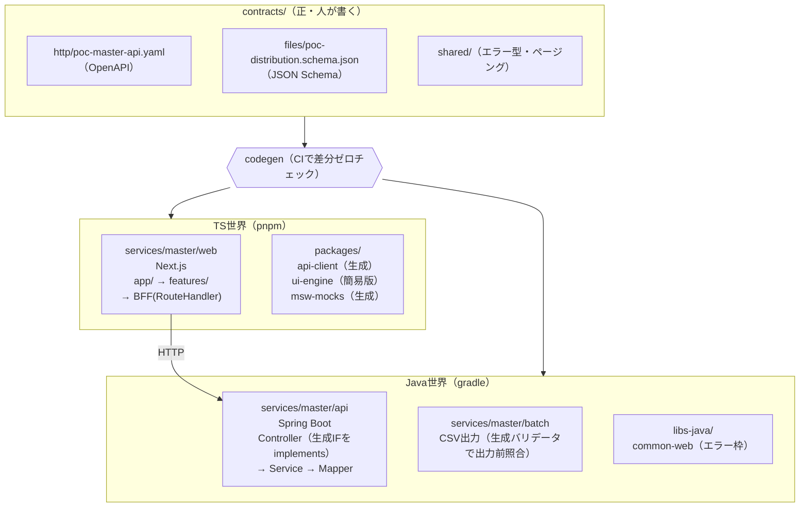

# PoC基本設計 — contracts駆動開発の検証

## 1. PoCの目的と検証項目

**目的**：「正しさを機械が落とす制約に寄せる」設計（要点版 §2 の見張り役①〜⑥）が、最小の縦切り1本で実際に成立することを確認する。

| # | 検証項目 | 合格基準 |
|---|---|---|
| V-1 | 契約→双方向codegen | 契約yamlを改変すると、TS側・Java側の両方が**コンパイルエラーで止まる** |
| V-2 | 越境・改変の機械検知 | 生fetch直書き／レイヤ違反／`generated/` 手書き改変が**CIで落ちる** |
| V-3 | モックによる並行開発 | BE未完成の状態で、MSWモックだけでFEの画面結合テストが通る |
| V-4 | CSV契約の機械検証 | JSON Schema からDTO＋バリデータを生成し、契約外csvが**取込/出力時に弾かれる** |
| V-5 | メタ定義駆動UI | マスタ個別の画面コードなしで、メタ定義の差し替えだけで2種類のマスタ画面が動く |

検証項目はすべて「人が読んで確認する」ではなく「機械が落とす／自動テストが通る」で判定する。

---

## 2. 全体構成

### 2.1 構成図



### 2.2 リポジトリ構成（本番モノレポの縮小相似形）

```text
poc/
├ contracts/                          ← 正の中心。全サービスの上位
│ ├ http/poc-master-api.yaml
│ ├ files/poc-distribution.schema.json
│ └ shared/components.yaml            （ErrorResponse・Pagingの共通定義）
├ packages/                           ← TS共通（業務ロジック禁止）
│ ├ api-client/   （生成物）
│ ├ msw-mocks/    （生成物）
│ └ ui-engine/    （メタ定義→CRUD画面の簡易レンダラ）
├ libs-java/                          ← Java共通（業務ロジック禁止）
│ └ common-web/   （エラーレスポンス正規化・相関IDログ）
├ services/
│ └ master/                          ← PoCは master 1サービスのみ縦切り
│   ├ web/    (Next.js: app / features / BFF)
│   ├ api/    (Spring Boot: Controller / Service / Mapper)
│   ├ batch/  (CSV出力1本)
│   └ db/     (DDL・メタ定義シード・認可スタブシード)
└ ci/                                 ← V-1〜V-4を落とすチェック群
  ├ codegen:check（再生成差分ゼロ）
  ├ dependency-cruiser + ESLint（TS越境）
  └ ArchUnit（Javaレイヤ・生成IF implements強制）
```

---

## 3. 主要コンポーネントと役割

| コンポーネント | 役割 | PoCでの簡略化（前提の明示） |
|---|---|---|
| `contracts/http` | 同期APIの正（OpenAPI）。マスタCRUD＋メタ定義取得のみ | 本番の4yaml（master/transaction/accounting/gw）のうちmaster相当1本に縮小 |
| `contracts/files` | 配布CSVの正（JSON Schema＋ファイルメタ：UTF-8・カンマ・ヘッダ有・CRLF） | 配布CSV 1種のみ。取込側（vehicle-import）は対象外 |
| `contracts/shared` | ErrorResponse（error-standards.md の6コード準拠）・Paging | エラーコード体系（PJ-MST-0001形式）は未確定のため**ダミー採番**と明記して使用 |
| codegenパイプライン | OpenAPI→TS型・APIクライアント・MSWハンドラ／Java interface・モデル。JSON Schema→Java DTO＋バリデータ | ツール選定（orval / openapi-generator等）はPoC内で比較・記録する（本番選定の入力） |
| `services/master/web` | FE＋BFF。app/（薄いルーティング）→features/（画面オーケストレーション）→ui-engine。BFFは整形・トークン受け渡しのみ | 認証はCognito未接続。**固定JWT（ローカル発行）**で代替 |
| `packages/ui-engine` | メタ定義（項目名・型・必須・コード値）を受け取りCRUD画面を描画する簡易エンジン | 一覧＋登録/編集フォームのみ。検索条件・項目間連動は対象外 |
| `services/master/api` | Controller（生成IFのimplements・JWT検証・400/401）→Service（業務チェック・**認可判定**・トランザクション）→Mapper | 認可はADR-0008どおりService層に置くが、認可マスタは**スタブテーブル**（モデル未確定 90 C-2のため割り切り） |
| `services/master/batch` | マスタ配布CSVを1本出力。出力直前に生成バリデータで契約照合（V-4） | 実行基盤（StepFunctions/CronJob）は使わずローカル起動。ただし共通枠（開始/終了/件数ログ・0件正常終了）の**置き場**は common-batch相当に分離 |
| `libs-java/common-web` | 例外→6コード正規化・相関IDログ。本番 common-web の骨格 | 監視基盤連携は対象外（ログ出力形式のみ合わせる） |
| `services/master/db` | DDL＋シード（メタ定義2マスタ分・認可スタブ・サンプルデータ） | PostgreSQLはdocker-composeでローカル起動 |

---

## 4. データフロー

### 4.1 開発時（契約→コード）

```text
契約改版（人がyaml/schema編集・必須レビュー）
  → codegen実行
      → TS: 型・api-client・MSWハンドラ
      → Java: interface・モデル・CSV DTO＋バリデータ
  → CIで codegen:check（生成物と契約の差分ゼロを保証）
```

- 方向は**常に契約→コードの一方向**。コードから契約を生成しない（ADR-0002）。AIが契約yamlを直接編集することも禁止（ADR-0009 / C-3対策）。

### 4.2 実行時（画面参照・更新）

```text
ブラウザ → Next.js app/ → features/ → BFF(Route Handler)
  → api-client（生成・これ以外の経路なし）
  → Spring Controller（生成IF） → Service → Mapper → PostgreSQL
```

- 戻りも同経路。エラーは common-web が6コード＋ErrorResponseに正規化してから返す。

### 4.3 実行時（CSV配布）

```text
batch起動（ローカルコマンド）
  → Service経由でレコード抽出
  → 生成DTOへ詰め替え → 生成バリデータで契約照合（NG時は異常終了＋件数ログ）
  → CSV出力（ファイルメタ：文字コード・区切り・改行も契約準拠）
```

### 4.4 FE先行開発時（モック）

```text
ブラウザ → Next.js → api-client → MSW（契約から生成したハンドラ＋examples）
```

- BEプロセス不要。契約のexamplesをそのままモックレスポンス・テストフィクスチャに使う（要点版 §6）。

---

## 5. 主要な処理フロー

### 5.1 マスタレコード参照（一覧）

1. FE: features/ がメタ定義取得API（`GET /poc/masters/{masterId}/meta`）を呼び、ui-engineに項目定義を渡す
2. FE: 一覧取得（`GET /poc/masters/{masterId}/records?page=..`）。Paging型は shared 共通定義
3. BE: Controller=JWT検証（失敗401）→ Service=認可照合（Read権限なし403）→ Mapper=取得
4. ui-engine がメタ定義に従い一覧を描画（マスタ個別コードなし・ADR-0003）

### 5.2 マスタレコード登録/更新

1. FE: ui-engineのフォーム（メタ定義から必須・型を導出）→ api-client 経由で `POST/PUT`
2. BE: Controller=入力チェック（契約の型/必須→400）→ Service=認可（C/U権限→403）・重複チェック（→409）・トランザクション制御 → Mapper=書込
3. 例外時: common-web が正規化したErrorResponseを返し、FEは**共通エラー画面**へ遷移（個別エラー画面を作らない・ADR-0010）

### 5.3 権限チェック（標準形の縮小実装）

permission-model.md §2 の4段フローを、スタブ認可マスタで実装する：

1. Controller: JWT署名・期限検証 → 401
2. クレーム解決: sub→スタブユーザーテーブル照合 → 解決不能401
3. Service: マスタID×CRUD で認可スタブ照合 → 権限なし403
4. 監査ログ出力（相関ID付き）

> **前提の明示**：認可**モデル**（ロール体系・粒度）は未確定（90 C-2）。PoCで検証するのは「判定の置き場（Service層）とフローの形」であり、スタブのテーブル構造を本番スキーマ案として扱わない。

### 5.4 契約違反の検知（PoCの主役・V-1/V-2）

意図的に違反を起こし、機械が落とすことを確認する破壊テストを手順化する：

| 違反操作 | 期待される検知 |
|---|---|
| 契約yamlのレスポンス項目をリネーム | TS型エラー＋Java interfaceコンパイルエラー（両側） |
| FEに生fetchを直書き | ESLint/dependency-cruiserでCI失敗 |
| Controllerに契約外エンドポイント追加 | 生成IF外のため検知（ArchUnit: implements強制） |
| `generated/` を手で修正 | codegen:check の差分でCI失敗 |
| CSV出力DTOに契約外の桁数を設定 | 生成バリデータが出力前に異常終了 |

---

## 6. インターフェース仕様の概要

### 6.1 同期API（contracts/http/poc-master-api.yaml）

| メソッド/パス | 役割 | 主な応答 |
|---|---|---|
| `GET /poc/masters/{masterId}/meta` | メタ定義（項目名・型・必須・コード値）取得 | 200 / 404 |
| `GET /poc/masters/{masterId}/records` | レコード一覧（Paging・簡易フィルタ） | 200 / 401 / 403 |
| `GET /poc/masters/{masterId}/records/{id}` | 1件取得 | 200 / 404 |
| `POST /poc/masters/{masterId}/records` | 登録 | 201 / 400 / 403 / 409 |
| `PUT /poc/masters/{masterId}/records/{id}` | 更新（楽観排他：バージョン番号） | 200 / 400 / 403 / 404 / 409 |
| `DELETE /poc/masters/{masterId}/records/{id}` | 削除 | 204 / 403 / 404 |

- HTTPステータスは [error-standards.md](../.claude/rules/error-standards.md) の6コードのみ使用
- `ErrorResponse`（エラーコード・メッセージ・相関ID）と `Paging` は `shared/` の共通コンポーネント参照
- 各レスポンスに `examples` を必ず書く（MSWモック・テストフィクスチャの源泉）
- メタ定義駆動のため、エンドポイントは `{masterId}` でパラメタライズし**マスタごとにパスを増やさない**

### 6.2 ファイル連携（contracts/files/poc-distribution.schema.json）

- 構造：レコード項目・型・桁・コード値を JSON Schema で定義
- ファイルメタ：文字コード=UTF-8 / 区切り=カンマ / ヘッダ=有 / 改行=CRLF（schemaの拡張プロパティとして同居）
- 運用方針（タイミング・再送）はPoC対象外（本番ではIF設計書側・[batch-common.md](../.claude/rules/batch-common.md)）

### 6.3 PoC対象のマスタ（メタ定義シード）

V-5検証のため、性質の異なる2マスタをシードする（**画面コードは共通の1本**）：

- 単純マスタ（例：部門相当 — 文字列・コード値のみ）
- 型バリエーションを持つマスタ（例：単価相当 — 数値・日付・必須/任意混在）

> **前提の明示**：実マスタ62オブジェクトの項目仕様は使わず、検証に必要な型パターンを網羅したダミー2種で代替する。

---

## 7. 前提条件 / 制約

### 7.1 前提条件（不明点の補完を含む）

| # | 前提 | 根拠/種別 |
|---|---|---|
| P-1 | 実行環境はローカル（docker-compose: PostgreSQL）。EKS・EventBridge/StepFunctionsは使わない | PoC簡略化。バッチは共通枠の「置き場」のみ本番相似 |
| P-2 | 認証はCognito未接続。ローカル発行の固定JWTで401系フローのみ検証 | 補完した前提（認証基盤接続はPoCの検証対象でないため） |
| P-3 | 認可マスタ・メタ定義テーブルはスタブ。本番スキーマ案ではない | 90 C-2（認可モデル未確定）を勝手に確定させないため |
| P-4 | エラーコード採番（PJ-MST-0001形式）はダミーと明記して使用 | error-standards.md で基本設計確定待ちのため |
| P-5 | codegenツールは PoC 内で比較選定し、選定理由を記録して本番判断の入力にする | 補完した前提（要点版に指定がないため） |
| P-6 | PoCコードは原則使い捨て。ただし contracts の書き方・CI設定・ui-engineの設計知見は本番へ持ち越す | 「後から拡張できる構成」の解釈 |

### 7.2 制約（ADR・ルール由来 — PoCでも破らない）

| 制約 | 由来 |
|---|---|
| リポ分割・言語別分割をしない。横断資産（contracts/packages/libs-java）に業務ロジックを置かない | ADR-0001 |
| 契約はdesign-first。コードから契約を生成しない。AIに契約yamlを直接編集させない | ADR-0002 / 0009 |
| マスタ個別の画面コード・マスタ別フォルダを作らない | ADR-0003 |
| 認可判定はBE Service層のみ。FE/BFF/Controller/Mapperに書かない。認可スキップ分岐を作らない | ADR-0008 |
| HTTPステータスは6コードのみ。個別エラー画面を作らない | ADR-0010 |
| バッチ：冪等性・0件正常終了・処理時間ログ。共通枠を個別実装しない | ADR-0011 |
| 生成ディレクトリの手書き改変禁止。CIチェック（lint/ArchUnit/codegen:check）を無効化しない | ADR-0009 / coding-standards.md |

### 7.3 スコープ外（明示）

- transaction / gw サービス、会計連携、社外API28本
- 取込側CSV（vehicle-import）、外部システムとの実接続
- 性能・可用性のNFR検証、監視基盤連携
- 認可モデル（ロール体系・粒度）の設計確定 — PoCは判定フローの形のみ

---

## 8. 未決事項の扱い（ADR-0012: ランタイム契約検証）

ランタイム契約検証（req/resの実行時照合・C-4対策）は **Proposed（未決）** のため、本PoCでは**導入も省略も確定しない**。

- PoCの基本構成には含めない（上記フローはcodegen＋CIまでで完結する）
- ただしPoCは判断材料の収集に適しているため、決着を急ぐ場合は「オプション検証（検証ライブラリのオーバーヘッド計測・導入箇所の比較）」を**別タスクとして人が判断のうえ**追加する — AI側からの先行実装はしない

---

## 9. 拡張パス（PoC後）

本PoCの構造は本番の縮小相似形のため、拡張は「増やす」だけで済む：

- `contracts/http/` に transaction-api / accounting-api / gw-api を追加（構造は同形）
- `services/` に transaction / gw を縦割りで追加（master と同形・サービス間直接依存なし）
- スタブ認可 → PJ様提供の認可情報スキーマ確定後に差し替え（判定の置き場は不変）
- 固定JWT → Cognito接続（Controller入口の検証ロジックは libs-java 側で差し替え）
- ローカルbatch → StepFunctions/CronJob（共通枠の置き場が分離済みのため個別バッチは不変）