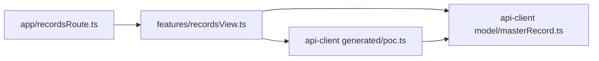

# V-2 技術調査 — dependency-cruiser

V-2 の機械ゲートで使う dependency-cruiser を「ちゃんと理解する」ための調査メモ。一次ソースは公式リポジトリ [sverweij/dependency-cruiser](https://github.com/sverweij/dependency-cruiser)（本 PoC 利用版: 16.10.4）。出典は末尾。

## 1. 何のツールか — 「Validate **and** visualise」、主役は検証

公式タグラインは **"Validate and visualise dependencies. With your rules."**。README は用途をこう書き分けている:

- **検証(validate)**: `depcruise src` でルール違反を出す（CI/ビルド用）
- **可視化(visualise)**: `--output-type dot` でグラフを描く ＝ *"to impress your grandma"*

「依存を画像で見せるツール」という紹介は**副次機能(可視化)だけを切り取った印象**。本体は「**自分で書いたルールに照らして依存を検証する linting フレームワーク**」であり、本 PoC が使う「lint では縛れない機械ゲート」用途こそ主機能にあたる。

## 2. 仕組み — 1つのエンジン、2つの出口

検証も可視化も「依存グラフの構築」までは共通。最後の出口(reporter)が違うだけ。

```
ソース
 → ① 抽出 : Acorn パーサで AST を読み import/require を拾う
 → ② 解決 : モジュールを実ファイルに解決（tsconfig paths も。§5）
 → ③ グラフ構築 : プロジェクト全体の依存グラフを作る
 → ④ ルール適用 : forbidden ルールに照合
 → ⑤ レポータで出力 :
       ├ err     → 違反をeslint風に列挙＋終了コード（CI用）   ← `pnpm depcruise`
       └ mermaid/dot/html/json → グラフ・図・データ（可視化用） ← `pnpm depcruise:graph`
```

**同じ `.dependency-cruiser.cjs` 設定のまま出口だけ変える**と、検証で使っている依存グラフがそのまま図になる(§6)。

## 3. なぜ ESLint では縛れないか — グラフの性質だから

ESLint は **1ファイルの AST** しか見ない。dependency-cruiser は ②③で**プロジェクト全体の依存グラフ**を作るので「グラフ全体を見ないと判定できない性質」を縛れる。

| 縛りたい性質 | 種類 | ESLint | dependency-cruiser |
|---|---|---|---|
| `fetch()` を書くな | 1ファイルの構文 | ✅ 得意 | ✗（依存ではない） |
| フォルダAからBへ依存するな（方向） | グラフの辺 | △ pluginで一応 | ✅ `from`/`to` |
| 循環依存（A→B→…→A） | グラフの閉路 | ✗ 実質不可 | ✅ `circular` |
| 到達可能性（孤立コード・推移依存） | グラフの連結性 | ✗ | ✅ `reachable` |

→ **生fetch=ESLint（構文の番人） / 層・循環・到達=dependency-cruiser（グラフの番人）**。性質が違うので両方要る。これが V-2 で2ツールに分けた理由。

## 4. forbidden ルールの構造（公式定義）と本PoCの設定

**ルール構造**（rules-reference より）:
- `name` … eslint風の短い識別子
- `severity` … `error`(=**非ゼロ終了コードでCIを落とす**) / `warn`(既定) / `info` / `ignore`
- `comment` … なぜ禁止か
- `from` / `to` … マッチ条件

**`from`/`to` の属性**:
- `path` … 正規表現。`from`=依存元ファイル、`to`=**解決後**の依存先にマッチ
- `pathNot` … マッチ**しない**もの＝除外
- `dependencyTypes` … 依存種別で絞る（`npm` / `npm-dev` / `local` 等）
- `circular` … 出発点に戻る依存（循環）か否かの真偽
- `reachable` … from から直接/**推移的に**到達できるか（1ファイルでは判定不能なグラフ専用検査）

本 PoC [.dependency-cruiser.cjs](../../.dependency-cruiser.cjs) の対応:

```js
{ name: "no-http-client-libs", severity: "error",
  from: { pathNot: "^packages/api-client/" },              // api-client 以外から
  to: { dependencyTypes: ["npm"], path: "^(axios|...)$" }}  // npm の http ライブラリへ → 禁止

{ name: "app-must-go-through-features", severity: "error",
  from: { path: "^services/master/web/src/app/" },          // app 層から
  to:   { path: "^packages/api-client/" }}                  // api-client 直叩き → 禁止（features 経由を強制）

{ name: "no-circular", severity: "error",
  from: {}, to: { circular: true }}                         // 循環 → 禁止（ESLint不可の代表例）
```

**終了コードの実測対応**: err レポータは **error 件数を終了コードに返す**。破壊テストで B=違反2件→exit `2`、C=違反1件→exit `1` だったのはこの仕様による。1件でも error があれば非ゼロ＝CI が落ちる。

## 5. tsconfig paths 解決が効いている理由

消費側は `@poc/api-client/generated/poc` という**エイリアス**で import するが、`options.tsConfig` を渡しているので ② の解決段で tsconfig `paths` を使い**実ファイル `packages/api-client/src/generated/poc.ts` に解決してから**ルール照合する。だから `to: { path: "^packages/api-client/src/generated/" }` のような実パス規則がエイリアス越しの import にも当たる。本番モノレポでアプリ間直接参照（`import/no-restricted-paths` 相当）を機械化する時も同手法。

## 6. グラフ出力スクリプト

PR コメント等で見せやすい **mermaid**（GitHub markdown が標準で描画）を採用。

| script | 役割 |
|---|---|
| `pnpm depcruise` | 検証（err レポータ・CIゲート） |
| `pnpm depcruise:graph` | 全体の依存グラフを mermaid で [doc/v-2/dependency-graph.mmd](dependency-graph.mmd) に出力 |
| `pnpm depcruise:affected` | **main 以降で変更されたモジュール＋それに到達できるモジュール**だけを mermaid 出力（影響範囲の可視化） |

現状の依存グラフ（`depcruise:graph` の出力を整形・抜粋）。`app → features → api-client` の一方向が、検証ルールと同じ設定から絵に出る:



> `.mmd` は再生成可能な成果物。CI で都度生成して PR に貼る運用を想定（§7）。

## 7. CI/CD 構想（GitHub Actions → PR コメント）

### 7.1 やりたいこと
PR を作ると CI が回り、**依存グラフ（特に今回の変更で影響した範囲）が PR コメントに貼られて**、レビュー前に「この変更がどこに波及するか」が一目で分かる状態。

### 7.2 実現方針（一次ソースで裏取り済みの機能で組める）
1. **検証ゲート**: `pnpm verify`（codegen:check → typecheck → lint → depcruise）を CI のマージ条件にする。
2. **グラフ生成**: `pnpm depcruise:affected` で **mermaid** を生成。mermaid は **GitHub の markdown コメントが標準で描画**するので、画像化(graphviz)不要でそのまま貼れる。
3. **影響範囲の特定**: `--affected`（公式: 「指定リビジョン以降に変更されたモジュール＋それらに到達できる全モジュール」。既定 `main`）で「この PR が触る依存サブグラフ」だけを出す。`--highlight` で変更モジュールを強調も可。
4. **PR コメント投稿**: 生成した mermaid を fenced code block として、sticky comment 系アクション（例: `marocchino/sticky-pull-request-comment`）や `actions/github-script` で本文に貼る。

擬似ワークフロー:
```yaml
# .github/workflows/pr-arch.yml（イメージ）
on: pull_request
jobs:
  arch:
    steps:
      - uses: actions/checkout@v4
        with: { fetch-depth: 0 }   # --affected が main と差分を取るため履歴が必要
      - run: pnpm install
      - run: pnpm verify           # ← 落ちたらマージ不可（V-1/V-2 ゲート）
      - run: pnpm depcruise:affected
      - uses: marocchino/sticky-pull-request-comment@v2
        with:
          header: dependency-graph
          path: doc/v-2/affected-graph.mmd  # mermaid をそのままコメント本文へ
```

### 7.3 「変更箇所から PR の重要度を判断する」案（発展）
dependency-cruiser には影響分析・指標系の出口があり、これを使うと“PR の重さ”を機械的に見積もれる:

- **`--affected` の規模**: 影響モジュール数が多い PR＝波及が広い＝レビュー重め、と定量化できる。
- **`--output-type json`**: cruise の内部表現を JSON 出力。「変更が `api-client`(契約境界) や `generated/` に触れているか」を機械判定し、触れていれば *needs-contract-review* ラベルを自動付与、等。
- **`--output-type metrics`**: モジュール/フォルダ単位の **instability（不安定度）等の結合指標**。安定（多くから依存される）モジュールを触る PR ほど影響が大きい、という重み付けに使える。

> 例: 「`packages/api-client/` や `contracts/` に触れる PR は重要度高(契約変更)」「`features/` 内に閉じる PR は低」を `--affected`/`json` で自動判定し、ラベル＋グラフコメントで提示する。境界（契約）に触れる変更を人間レビュー必須にする方針（親設計 §02-api-contract）とも噛み合う。

これらは**構想段階**。本 PoC のスコープ（V-2 の機械検知の実証）には `depcruise:graph` / `depcruise:affected` までを含め、GitHub Actions 連携・重要度自動判定は「拡張パス」として記録に留める。

---

## 8. tsconfig `baseUrl` 非推奨対応（TS 7.0 廃止予定）

### 8.1 事象
エディタ(TS Language Service)が [tsconfig.base.json](../../tsconfig.base.json) に対し次の警告を出していた:

> オプション 'baseUrl' は非推奨であり、TypeScript 7.0 で機能しなくなります。compilerOption '"ignoreDeprecations": "6.0"' を指定して、このエラーを無音にします。

本 PoC は `typescript: ^5.7.0`。`baseUrl` は TS 5.x で非推奨化され **TS 7.0 で廃止予定**。

### 8.2 原因と判断
`baseUrl: "."` は `paths`（`@poc/api-client/*` エイリアス）を解決するためだけに置いていた。だが **TS 4.1 以降、`paths` は `baseUrl` 無しで動く**（相対パスは tsconfig の位置基準で解決される）。本設定の `paths` は既に `./packages/api-client/src/*` と相対指定のため、`baseUrl` は不要だった。

- `baseUrl` に依存するベアインポート（`packages/...` / `src/...` の直接指定）は repo 内に存在せず（grep 確認）、利用は `@poc/api-client/*` エイリアス経由のみ。
- よって **削除が安全**。`ignoreDeprecations` で黙らせる案は先送りにすぎず不採用。

### 8.3 対応
[tsconfig.base.json](../../tsconfig.base.json) から `"baseUrl": "."` を削除（`paths` はそのまま）。

検証（いずれも通過）:
- `pnpm typecheck` … エラー 0。エイリアス解決は維持。
- `pnpm depcruise` … 違反 0（14 modules / 18 deps）。§5 の `options.tsConfig` 経由の paths 解決も `baseUrl` 無しで機能することを実測確認。

> 教訓: モノレポの paths エイリアスに `baseUrl` はもう要らない。相対 `paths` だけで TS 7.0 でも動く構成にしておく。

---

## 出典（一次ソース）
- [TypeScript — Module Resolution / `paths` は `baseUrl` 非依存（4.1+）](https://www.typescriptlang.org/tsconfig#paths)
- [sverweij/dependency-cruiser — 公式リポジトリ README](https://github.com/sverweij/dependency-cruiser)
- [doc/rules-reference.md — forbidden ルール / severity / from・to / circular・reachable の定義](https://github.com/sverweij/dependency-cruiser/blob/main/doc/rules-reference.md)
- [doc/cli.md — `--output-type`(mermaid/dot/json/metrics 等) / `--output-to` / `--affected` / `--focus` / `--highlight` / err の終了コード](https://github.com/sverweij/dependency-cruiser/blob/main/doc/cli.md)
- [doc/options-reference.md — `options.tsConfig` 等の解決オプション](https://github.com/sverweij/dependency-cruiser/blob/main/doc/options-reference.md)
