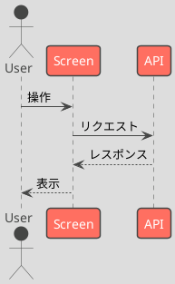
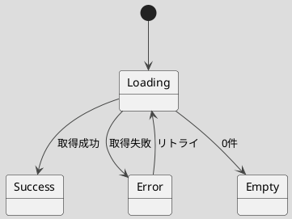
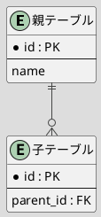
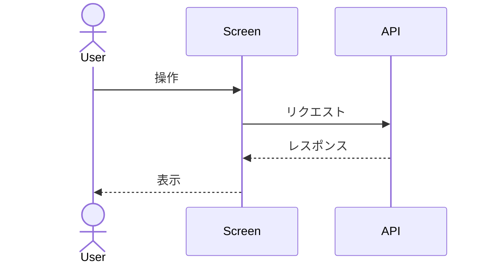
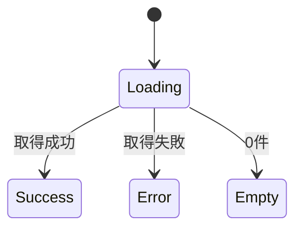

# 図フォーマット規約（diagram_format）

> **位置づけ：第1層・標準（サイト非依存）。** 全サイト共通の図の書き方を定める。特定サイトの構成図そのものはここに置かない（各サイトの `04_アーキテクチャ`）。
> **判断基準：** 図の表記が決まっていないと、同じ対象を別の記法で描いてしまい差分・レビューが破綻する。だから記法・ツール・配置を標準化する。
> **正本：** `design_architecture.md` §5.1 が上位規約。本ファイルはそれを具体化する。
> **手本：** フューチャー株式会社「Markdown設計ドキュメント規約」。本ファイルはその図の節を下敷きにする。手本に無いルールは発明しない（不足は §7 `〔要確認〕` に残す）。

---

## 1. 用途別ツール表

| 用途 | ツール | 指定 |
|------|--------|------|
| シーケンス図・状態遷移図・ER図 | PlantUML | テーマ `toy` を指定 |
| 同上（代替可） | Mermaid.js | — |
| システム構成図など複雑な図 | draw.io | 拡張子 `.drawio.png` / `.drawio.jpg` / `.drawio.svg` |

**方針：** 図は Git 差分と相性の良いテキストベース（PlantUML / Mermaid）を基本とする。テキストで表現しきれない複雑な構成図のみ draw.io を使う。

---

## 2. PlantUML 最小サンプル（テーマ `toy` 必須）

PlantUML を使う図は、冒頭で必ず `!theme toy` を指定する。

### 2.1 シーケンス図

### 2.2 状態遷移図

### 2.3 ER図

---

## 3. Mermaid 代替サンプル

PlantUML の代替として Mermaid を使ってよい。1つの成果物内では記法を混在させない。

---

## 4. draw.io（複雑な構成図）

- システム構成図など、テキスト記法で保守が難しい複雑な図に限定して使う。
- 書き出し拡張子は `.drawio.png` / `.drawio.jpg` / `.drawio.svg` のいずれか（編集情報を埋め込んだ形式）。元データを失わないため、画像のみの貼り付けは不可。
- 1つの図は1ファイルとする。

---

## 5. 図ファイルの配置・命名

- PlantUML / Mermaid は、原則として参照元の Markdown 内にコードブロックで直接記述する（テキスト差分を残すため）。
- 外部ファイルに切り出す場合・draw.io を使う場合は、その図を参照する成果物と同じフォルダに置く。
- ファイル名は対象が分かる名前にし、ID体系がある図（画面・API等）は `naming_convention.md` の採番に合わせる。
- 命名規約の詳細は `naming_convention.md` が正本。本ファイルでは重複定義しない。

---

## 6. 色使いの方針

- 色は多用しない（手本に準拠）。意味を持たせる必要がある箇所のみ最小限に使う。
- 色だけで情報を区別しない（白黒でも判別できるよう、ラベル・形でも区別する）。
- PlantUML はテーマ `toy` の既定配色を基本とし、個別の色指定は必要時のみ。

---

## 7. 〔要確認〕事項

手本（フューチャー）に明記が無く、想像で足さない項目。必要であればユーザー確認のうえ追記する。

- 〔要確認〕図のレビュー手順（誰がいつ図をレビューするか）は手本に無いため未規定。
- 〔要確認〕draw.io の編集ツール／バージョンの統一指定は手本に無いため未規定。
