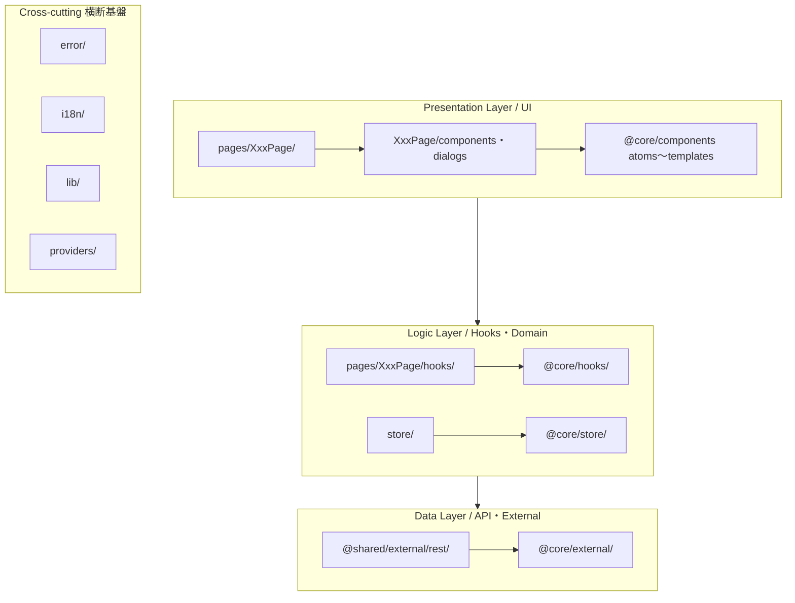

# アーキテクチャ

## 技術スタック

| カテゴリ | ライブラリ | バージョン | 役割 | 同カテゴリの代替候補 |
|---|---|---|---|---|
| フレームワーク | React | ^19.0.0 | UIフレームワーク | Vue, Svelte, Solid |
| ルーティング | react-router-dom | ^7.13.0 | SPA ルーティング | TanStack Router, Next.js App Router |
| 状態管理 | Jotai | ^2.10.3 | クライアント状態のアトミック管理 | Zustand, Redux Toolkit, Recoil |
| フォーム | React Hook Form | ^7.43.9 | フォーム状態管理・バリデーション | Formik, React Final Form |
| バリデーション | Zod | ^3.22.3 | スキーマバリデーション | Yup, Valibot, ArkType |
| フォームリゾルバ | @hookform/resolvers | ^3.10.0 | Zod ⇔ RHF ブリッジ | 手動バリデーション |
| スタイリング | Sass (CSS Modules) | ^1.58.1 | コンポーネントスコープCSS | Tailwind CSS, styled-components, vanilla-extract |
| パターンマッチ | ts-pattern | ^5.7.1 | 型安全な条件分岐 | switch文, if-else |
| 国際化 | i18next + react-i18next | ^22.5.1 / ^12.3.1 | 多言語対応 | FormatJS (react-intl), LinguiJS |
| 日付 | dayjs | ^1.11.7 | 日付処理 | date-fns, Luxon, Temporal API |
| チャート | Chart.js + react-chartjs-2 | ^4.2.1 / ^5.2.0 | データ可視化 | Recharts, Nivo, D3 |
| DnD | @dnd-kit | core ^6.3.1 | ドラッグ＆ドロップ | react-beautiful-dnd, react-dnd |
| ドロワー | vaul | 1.1.1 (パッチ適用) | モバイル向けハーフモーダル | Radix Dialog, Headless UI |
| ズーム | react-zoom-pan-pinch | ^3.7.0 | 画像ズーム・パン操作 | react-medium-image-zoom |
| 認証 | oidc-c-ts + react-oidc-context | ^2.2.4 / ^2.2.2 | OpenID Connect 認証 | Auth0 SDK, NextAuth |
| 暗号化 | crypto-js + jsrsasign | ^4.2.0 / ^11.0.0 | クライアント暗号・署名処理 | Web Crypto API |
| エラーバウンダリ | react-error-boundary | ^6.0.0 | React エラーバウンダリ | 自前実装 |
| ファイルアップロード | react-dropzone | 14.3.8 | ファイル選択/ドロップUI | 自前 input[type=file] |
| 並行制御 | p-limit | ^6.2.0 | 同時実行数の制限 | 自前 Semaphore |
| 監視 | @datadog/browser-rum | ^6.27.1 | Real User Monitoring | Sentry, New Relic |
| ビルドツール | Vite | ^7.2.2 | 開発サーバー/バンドラ | Webpack, Turbopack, Rspack |
| テスト | Vitest | ^4.0.18 | ユニット/統合テスト | Jest |
| テストUI | Testing Library (React) | ^16.0.1 | コンポーネントテスト | Enzyme (非推奨) |
| E2E | Playwright | ^1.56.1 | ブラウザ自動テスト | Cypress |
| VRT | reg-suit + storycap | ^0.14.5 / ^2.0.0 | ビジュアルリグレッションテスト | Chromatic, Percy |
| Storybook | Storybook | ^10.2.8 | コンポーネントカタログ/テスト | Ladle |
| API モック | MSW | ^2.10.4 | サービスワーカーによるAPIモック | miragejs |
| リンター | ESLint (Flat Config) | ^9.8.0 | コード品質チェック | Biome |
| フォーマッタ | Prettier | ^2.8.8 | コード整形 | Biome |
| スペルチェック | cspell | ^9.0.2 | スペルチェック | - |
| コード生成 | Hygen | ^6.2.11 | テンプレートベースのコード生成 | plop, scaffdog |
| Git Hooks | simple-git-hooks + lint-staged | ^2.11.1 / ^15.2.10 | コミット前のリント実行 | Husky + lint-staged |
| パッケージ管理 | pnpm (workspace) | 10.29.3 | モノレポ管理 | npm workspaces, Yarn, Turborepo |
| ランタイム | Node.js | 24.13.1 (Volta 固定) | JavaScript ランタイム | - |
| TypeScript | typescript | * (workspace) | 型安全な開発 | Flow (非推奨) |

## ディレクトリ構成

### トップレベル構成（モノレポ）

```
root/
├── packages/              # git submodule で管理される共通基盤
│   └── service/           # 共通コンポーネント・ドメイン・API層（@core）
├── app/                   # メインアプリ（@app）。デスクトップとモバイルを統合
├── app-admin/             # 管理者向けアプリ（@app-admin）
├── app-external/          # 外部公開向けアプリ（@app-ext）
├── shared/                # アプリ間共有コンポーネント（@shared）
├── patches/               # サードパーティライブラリのパッチ
└── scripts/               # ビルド・CI スクリプト
```

構成は pnpm workspace と git submodule を組み合わせたモノレポ。3つのアプリケーションが1つのリポジトリに共存し、共通パッケージ `packages/service` だけは git submodule として別リポジトリで管理する。

デスクトップとモバイルは別アプリに分けない。単一の `app` がレスポンシブ設計で両方の画面サイズを扱う。画面幅に応じてレイアウトやUI部品（例: 広い画面はサイドバー、狭い画面は vaul のハーフモーダル）を切り替える。端末ごとにコードベースを二重持ちしないことで、ドメインロジックの重複と実装のズレを防ぐ。

依存関係はルートの `package.json` にまとめ、各アプリの `package.json` にはスクリプト定義しか置かない。バージョンは一箇所で管理する。

### 共通基盤パッケージ（`@core`）の内部構成

```
service/src/
├── components/            # UIコンポーネント群（Atomic Design）
│   ├── atoms/             #   最小単位（ボタン、入力、アイコン、ポータル）
│   ├── molecules/         #   atoms の組合せ（モーダル、ドロワー、フォーム部品）
│   ├── organisms/         #   複合UI（ヘッダー、サイドバー、リスト）
│   ├── templates/         #   ページ骨格（モーダルテンプレート）
│   └── pages/             #   共通ページ（存在するがほぼ空）
├── domain/                # ビジネスドメイン
│   ├── auth/              #   認証（OIDC）
│   ├── constants/         #   定数定義
│   └── types/             #   型定義（レスポンス型、ドメインモデル型）
├── external/              # 外部サービス連携
│   ├── api/               #   API スキーマ定義（型定義）
│   ├── rest/              #   REST API クライアント実装
│   ├── datadog/           #   監視サービス
│   └── storage/           #   ブラウザストレージ
├── hooks/                 # 共通カスタムフック
├── store/                 # 共通 Jotai Atom 定義
├── error/                 # エラーハンドリング基盤
├── lib/                   # ユーティリティ（ルーター、URL、パーサー）
├── i18n/                  # 国際化基盤
└── tests/                 # テスト共通設定
```

共通基盤の UIコンポーネントは Atomic Design で分類する。atoms → molecules → organisms → templates の階層を作り、参照は下位から上位への一方向に限る。Atomic Design は Brad Frost が提唱した UI の構成手法で、デザインシステムやコンポーネントライブラリのように、粒度で部品を整理して再利用したい層に向く。`@core` はまさに全アプリが共有する部品ライブラリなので、この分類を採る。

Atomic Design はこの共通基盤パッケージの中だけで使う。アプリケーション層はこの分類を引き継がない。アプリ側は `@core` の atom 〜 organism を組み合わせて画面用のUIを組み上げ、できあがったコンポーネントはページや機能の単位で配置する。粒度の階層はライブラリの内部構造、利用範囲による配置はアプリの構造、と役割を分ける。

### アプリケーション層の内部構成

デスクトップとモバイルで構成を分けない。全アプリが次の単一構成に従う。

```
app/src/
├── pages/                 # ページ。UIとロジックはすべてここに集約する
│   └── XxxPage/
│       ├── XxxPage.tsx    #   ページ本体。hooks を組み立てて画面を構成する
│       ├── components/    #   ページ固有コンポーネント
│       ├── dialogs/       #   ページ固有のモーダル・ドロワー
│       └── hooks/         #   ページのドメインロジック（API呼び出しもここ）
├── routes/                # ルーティング定義
│   ├── components/        #   ルートガードコンポーネント
│   └── hooks/             #   ルーティングフック
├── providers/             # React Context プロバイダ群
├── store/                 # グローバル Jotai Atom 定義（状態はすべてここで定義）
├── i18n/                  # 国際化リソース
└── styles/                # グローバルスタイル
```

アプリのトップレベルに `components/`, `dialogs/`, `hooks/` を置かない。これらはすべてページ配下にまとめる。画面に属するコンポーネント、ダイアログ、フックを `pages/XxxPage/` の中へ同置し、アプリ直下に共有の置き場を作らない。ページをまたいで使い回したくなったものは `@shared` か `@core` へ上げる流れを、置き場がないことで自然に強制する。

UIは `@core` の部品を組み合わせて作る。アプリ側で atom を自前定義せず、`@core` の atom 〜 organism を組み立てて画面用のコンポーネントにし、それをページ配下の `components/` や `dialogs/` へ置く。粒度の階層は `@core` が持ち、アプリ側はその組み合わせ方とドメインロジックに集中する。

ページのドメインロジックは `pages/XxxPage/hooks/` に集約する。`XxxPage.tsx` 本体はフックを呼び出して結果を画面に並べるだけにし、状態の取得・更新やビジネスルールはフック側へ寄せる。ロジックとそれを使うUIを同じページの中にまとめ、読むときの行き来を減らす。

API と状態の扱いは次のとおり。

- API 呼び出しは hooks の中で行う。ページが API を直接 fetch することはない。API そのものはインターフェース（型）だけを `@core/external/api` に共通定義し、機能固有の API という括りは作らない。
- 状態はグローバルに `store/` で定義する。ページ配下に store を置くことはしない。

### 分割方式の判定

ページへのコロケーションを主軸に置く。

UIとロジックはページの中にまとめ、配置はもっぱら利用範囲で決める。1つのページでしか使わないなら `pages/XxxPage/` 配下に置き、複数ページや複数アプリから使うものは `@shared` か `@core` へ上げる。近くに置く、広く使うものだけ共有する、という原則で段階的に昇格させる。

コードを関連する場所のできるだけ近くに置くと保守しやすく、関連するテストや実装にも気付きやすい。この配置の根拠は Kent C. Dodds の「Colocation」にある。一方、`@core` の部品ライブラリは Atomic Design で粒度ごとに整理する。粒度で整理するのはライブラリ層、利用範囲で配置するのはアプリ層、と層によって基準を分ける。

### コンポーネント配置ルール（パターン抽出）

| 配置場所 | 基準 | 具体例 |
|---|---|---|
| `@core/components/` | 全アプリで共通利用されるUIプリミティブ（Atomic Design） | ボタン、モーダル、レイアウト、フォーム部品 |
| `@shared/components/` | 一部のアプリ間で共有されるコンポーネント | ドメイン固有の共有コンポーネント |
| `app/pages/XxxPage/components/` | 1つのページ内でのみ利用するコンポーネント | ページ固有リスト、ヘッダー |
| `app/pages/XxxPage/dialogs/` | 1つのページ内のモーダル・ドロワー | 確認ダイアログ、編集ドロワー |

共通化の昇格基準はシンプルで、複数ページや2つ以上のアプリから参照されるなら `@shared` へ、全アプリ共通なら `@core` へ移す。アプリ直下に共有の置き場を持たないので、ページをまたいで使うものは共通パッケージへ上げるしかない。ESLint の `import/no-restricted-paths` でアプリ間の直接参照を禁止し、この移動を強制する。

## レイヤー設計

### 依存関係の方向（3層 + 横断基盤）



依存は上位から下位への一方向に限り、UI → Logic → Data の向きにしか流れない。逆向きは禁止。

モジュール間の参照も単方向にそろえる。`@core` / `@shared` の共通層 → アプリの `pages/` の向きにだけ流す。ページが共通層を参照し、共通層がアプリを参照することはない。アプリ間の直接参照も禁止し、`import/no-restricted-paths` で機械的に強制する。

UIコンポーネントから直接 fetch している箇所はない。API 呼び出しはすべてカスタムフック `useXxxAction` を経由する。

### カスタムフックの責務パターン

カスタムフックは命名規則で責務を分けてある。

| 命名パターン | 責務 | 層 |
|---|---|---|
| `useXxxState()` | Atom の読み取り専用ラッパー | 状態読み取り層 |
| `useXxxAction()` | API呼び出し + Atom 更新 + エラーハンドリング | ビジネスロジック層 |
| `useXxxDrawer()` / `useXxxModal()` | モーダル・ドロワーの開閉状態管理（排他制御付き） | UI制御層 |
| `useXxxRedirect()` | URLクエリパラメータに基づくリダイレクト処理 | ナビゲーション層 |

同じドメインに対して、読み取りの `useXxxState` と書き込みの `useXxxAction` を分ける。読み取りだけのコンポーネントが書き込みロジックに依存しなくなり、不要な再レンダリングを減らせる。

### データ層の構造

```
@core/external/
├── api/           # API レスポンス・リクエストの型定義（自動生成 or 手動定義）
├── rest/          # REST API クライアント（fetch ラッパー）
└── ...

@shared/external/
└── rest/          # ドメイン固有の API クライアント
```

API クライアントは純粋な関数で、React フックに依存しない。フック側がそれを呼び出す形にして、データ層とUI層の結合を抑える。レスポンスの型変換は `camelcase-keys` / `snakecase-keys` に任せる。

### エラーハンドリングの一元化パターン

`useErrorAction()` をベースに、各アプリが `useXxxErrorHandlingAction()` という特化版を定義する。API エラーは型クラス `ApiError` で構造化し、エラーコードごとに分岐する。エラーページへの遷移、スナックバー表示、ログ送信は一箇所でまとめて扱う。

### 並行実行制御パターン

- `useSemaphoreCallback()`: ユーザー操作の重複実行を防ぐセマフォ。ボタン連打やナビゲーション連打を安全にブロックする。
- `useAtomActionCallback()`: Jotai の `useAtomCallback` をラップし、依存配列の安定性を保証するカスタムフック。
- `withAppLoading()`: ローディング状態を自動で管理する。API呼び出しを囲むだけで表示/非表示を切り替える。
- `p-limit`: 並行リクエスト数を制限する（例: ファイルアップロードの同時実行数）。

## ルーティング

### ルーティングの仕組み

ルーティングはコード定義ベースで、ファイルベースルーティングではない。

- `react-router-dom` v7 の `createBrowserRouter` + `createRoutesFromElements` を使う。
- 各アプリが `routes/` 配下でルート定義を持つ。
- パスプレフィックス（`base`）でアプリを分ける。`/ap`（メインアプリ）, `/aps`（管理）, `/apv`（外部公開）。

### レイアウトの共通化方法

ネストルートと Provider ラッピングを組み合わせる。

```
<AppRootProviders>          ← エラー・認証・スナックバー等のプロバイダ群
  <PrivateRoute>            ← 認証ガード + 初期データフェッチ + 共通レイアウト
    <BasicLayout>           ← サイドバー + メインコンテンツのレイアウト
      <Outlet />            ← 各ページがここにレンダリングされる
    </BasicLayout>
  </PrivateRoute>
</AppRootProviders>
```

- `PrivateRoute` が認証ガード、初期データフェッチ、共通レイアウトの3つの責務を担う。
- 未認証時はデータフェッチ完了まで `null` を返してローディングを制御する。
- 認証不要ルート（エラーページ）は `PrivateRoute` の外側に置く。

### 認証ガードの配置場所

- ルートレベル: `PrivateRoute` コンポーネント内で `useAuthContext()` を使う。
- 外部認証基盤: OIDC (OpenID Connect) を使い、`oidc-c-ts` + `react-oidc-context` で抽象化する。
- 認証ハンドラ: `AuthRouteHandler` がトークンリフレッシュ、未認証リダイレクト、セッション管理をまとめて扱う。
- 初期化フロー: 認証成功後、`useAtomActionCallback` で Jotai Atom に初期データ（ユーザー情報、ライセンス、テナント設定など）を一括セットする。

### ルートの動的振り分け

- `ts-pattern` の `match` で、URLパラメータをもとに型安全にルートを分岐する。
- ファイルIDの正規表現 `/^f[0-9]+$/` でリソース種別を判定し、別のページコンポーネントへ振り分ける。

## ビルドと TypeScript の設計思想

### TypeScript 設定

- `strict: true`: 厳格な型チェックを有効化する。
- `moduleResolution: "bundler"`: 各アプリは bundler モード（Vite 最適化）。共通基盤は `"Node"` モード。
- `isolatedModules: true`: 型のみのインポートに制約を課し、ビルドの安全性を確保する。
- `noEmit: true`: TypeScript はビルド時の型チェック用。Vite（esbuild/SWC）がトランスパイルを担う。
- `noErrorTruncation: true`: 全アプリで有効化。型エラーメッセージの省略を防ぎ、デバッグしやすくする。

### パスエイリアスの設計

```
@core/*     → packages/service/src/*      # 全アプリ共通の基盤
@shared/*   → shared/src/*                # アプリ間共有
@app/*      → app/src/*                   # アプリ固有（自分自身）
```

- 各アプリは `@core` と `@shared` を共通参照し、自分自身を `@app`（例: `@ap`）で参照する。
- `tsconfig.json` の `paths` と `vite.config.ts` の `resolve.alias` で二重に定義する。型チェックとビルドの両方で解決する必要があるため。
- 共通基盤の `tsconfig.json` を `extends` で継承する。各アプリの tsconfig は共通設定を引き継ぎ、パスエイリアスとアプリ固有の設定だけ上書きする。

### ESLint の設計思想

- Flat Config 形式。ESLint v9 の新しい設定形式を採る。共通基盤が `eslint.config.js` を定義し、各アプリがそれを import して拡張する。
- `react-you-might-not-need-an-effect`: 不要な `useEffect` を機械的に検出するプラグイン。8つのルールをすべて `error` で有効化し、派生状態の計算や状態の連鎖更新を防ぐ。
- `exhaustive-deps` のカスタムフック対応: `useSemaphoreCallback`, `useAtomActionCallback` などの独自フックも依存配列チェックの対象に加える。
- `import/no-restricted-paths`: アプリ間の直接参照を禁止する。あるアプリから別アプリのコードを参照するとエラーになり、共通パッケージ（`@shared` / `@core`）への移動を促す。
- `import/order`: import 文を `internal → relative → builtin → external` の順に、アルファベット順で並べる。
- 命名規約の統一: `@typescript-eslint/naming-convention` で変数や関数、クラス、インターフェース、列挙型の命名を縛る。

### ビルド設定

- Vite のモードベースビルド: `--mode loc`, `--mode dev`, `--mode prd` でビルドモードを切り替える。`.env.loc`, `.env.dev`, `.env.prd` で設定を分ける。
- MSW の本番除外: カスタム Vite プラグイン `removeMSW` が、本番ビルド時に `mockServiceWorker.js` を自動で削除する。
- API プロキシ: 開発サーバーで `server.proxy` を使い、API パス（`/d/api`, `/auth/v1` など）をバックエンドへ流す。
- Volta による Node.js バージョン固定: `volta.node` でチーム全体の Node.js バージョンを揃える。

### テスト設定

- Vitest の workspace プロジェクト機能: ルートの `vitest.config.mts` で全アプリのテストを `projects` としてまとめて管理する。各アプリの `vite.config.ts` をそのまま拡張する。
- jsdom 環境: 全アプリで `environment: "jsdom"` を使い、ブラウザAPIを模す。
- `globals: true`: `vi`, `expect`, `describe`, `it` などをインポートなしで使える。
- VRT（Visual Regression Testing）: Storybook と storycap でスナップショットを取り、reg-suit で差分を検出する。Slack 通知とも連携する。

## 設計思想のまとめ

このプロジェクトを貫く設計思想は5つある。

共通基盤を git submodule で分離し、pnpm workspace でアプリ群を束ねるモノレポ戦略。メインアプリ（デスクトップとモバイルを統合）/管理/外部の各アプリが同じリポジトリに共存しつつ、UIコンポーネントライブラリや認証基盤は別リポジトリで独立して管理する。ESLint ルールでアプリ間の直接参照を止め、共通化の昇格フローを仕組みとして強制する。

Jotai Atom と State/Action カスタムフックによる状態管理の責務分離。グローバル状態は Jotai のアトミックモデルで持ち、読み取り専用の `useXxxState` と、API呼び出しと書き込みを担う `useXxxAction` に分ける形を全アプリで揃える。UIコンポーネントは状態の読み取りだけに依存するので、ビジネスロジックを変えてもUI層に波及しにくい。

不要な useEffect を排除する仕組み。`react-you-might-not-need-an-effect` の全ルールを error にして、派生状態の計算、状態の連鎖更新、イベントハンドラ内の処理を `useEffect` で書くことを禁止する。React 公式の "You Might Not Need an Effect" をチーム全体で徹底するための歯止め。

部品ライブラリの Atomic Design とアプリのページコロケーションを役割で分ける。`@core` は全アプリ共通の部品ライブラリとして atoms 〜 templates の粒度階層で整理する。アプリ側はその atom を組み合わせて画面用のUIを組み上げ、コンポーネント、ダイアログ、フックをページディレクトリ内に同置する。ページのドメインロジックは `pages/XxxPage/hooks/` に集約し、複数ページや複数アプリで使うものだけ `@shared`, `@core` へ段階的に上げる。粒度で整理するのはライブラリ層、利用範囲で配置するのはアプリ層。Atomic Design は Brad Frost、ページコロケーションは Kent C. Dodds の Colocation を下敷きにしている。

並行実行制御とローディングの一元管理。`useSemaphoreCallback` の Semaphore パターンで重複操作を防ぎ、`withAppLoading` でローディング状態を自動で切り替える。API エラーは `ApiError` で構造化し、エラーコード別のハンドリングを一箇所に集める。ユーザー操作の安全性とエラー復帰の予測しやすさを設計のレベルで担保している。
