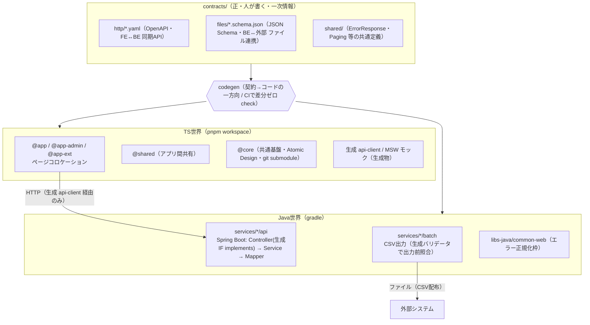

# 全体基本設計書

> 本書は契約駆動の実システム（FE: React 19 monorepo ＋ BE: Java / Spring Boot）全体を貫く**設計思想・全体アーキテクチャ・契約・機械ゲート・検証計画**を定義する。
> FE / BE の具体は [10-FE.md](10-FE.md) / [20-BE.md](20-BE.md) に置く。重複は本書（①）に寄せ、②③は本書を参照する。
> PoC（[`app/contracts_poc`](../../app/contracts_poc)）は**設計を実証した検証エビデンス**として参照する位置づけであり、PoC 自体の設計書ではない。

---

## 1. 目的とスコープ

### 1.1 目的
契約（`contracts/`）を全システム間インターフェースの一次情報とし、そこから FE / BE の両世界へ一方向に codegen する「契約駆動開発」を本番プロダクトの設計原則として確立する。**正しさを散文のレビューではなく機械が落とすゲートに寄せる**ことを全体を貫く方針とする。

### 1.2 スコープ
- 対象: 契約駆動の実システム全体。FE（TS 世界）と BE（Java 世界）を貫く設計。
- 本書が定義するもの: 設計思想・全体アーキテクチャ・契約の扱い・システム間インターフェース・横断的な機械ゲート・横断的関心事・検証計画 V-1〜V-5・ロードマップ・ADR / 制約一覧。
- 本書が定義しないもの: 各世界の実装詳細（FE → ②、BE → ③）。API 仕様そのもの（BE 提供の契約が一次情報）。
- 前提: **BE の実コードはまだ存在しない**。BE に関する記述は「設計＋検証計画」が中心であり、実装値（マスタ名・エラーコード採番・認可モデル）は**ダミー / 未確定として明示**する（PoC 親設計 §7 の前提表に倣う）。

### 1.3 PoC の位置づけ
PoC は本番モノレポの**縮小相似形**として、設計の核（契約→codegen→機械ゲート）が最小の縦切り1本で成立することを実証する。本書の各節は PoC のどの検証で裏付けられているかを §8 でリンクする。PoC コードは原則使い捨てだが、契約の書き方・CI 設定・破壊テスト手順・ui-engine の設計知見は本番へ持ち越す（親設計 §7.1 P-6）。

---

## 2. 設計思想

出典: [`.claude/steering/00-principles.md`](../../.claude/steering/00-principles.md)。一次ソースは Anthropic Claude Code Best practices / React 公式 "You Might Not Need an Effect" / Atomic Design(Brad Frost) / Colocation(Kent C. Dodds)。

1. **契約駆動**。`contracts/` を全システム間インターフェースの正とし、コードから契約を生成しない一方向 codegen に統一する。AI に契約を直接編集させない（ADR-0002 / 0009）。
2. **モノレポ戦略**。共通基盤を分離（FE は `@core` を git submodule、BE は `libs-java`）しつつ単一リポジトリに束ねる。境界（アプリ間直接参照・レイヤ逆流・越境）は機械で禁止し、共通化の昇格フローを仕組みで強制する。
3. **状態責務分離**（FE 中心）。グローバル状態は Jotai のアトミックモデルで持ち、読み取り `useXxxState` と書き込み `useXxxAction` を分ける。
4. **不要 useEffect の排除**（FE 中心）。派生状態の計算 / 状態の連鎖更新 / イベント処理を `useEffect` で書かない。`react-you-might-not-need-an-effect` 全8ルールを error で機械強制する。
5. **層で基準を分ける配置**。粒度で整理するのはライブラリ層（FE `@core` = Atomic Design / BE `libs-java`）、利用範囲で配置するのはアプリ層（FE ページコロケーション / BE サービス縦割り）。
6. **正しさを機械に寄せる**。散文の規約は逸脱しうる。強制力は型 / lint / dependency-cruiser / ArchUnit / codegen:check / contract test に置く。ここに無い規約は努力目標とみなす（[`05-enforcement.md`](../../.claude/steering/05-enforcement.md)）。

### 開発の進め方の原則
- 不確実なら実装せず質問する。スコープ拡大は提案にとどめる。
- 検証手段のないものはマージしない（型 / lint / テストいずれかの合否シグナルを必ず伴わせる）。
- 探索→計画→実装→コミットを分ける。複数ファイル・不慣れな箇所は plan mode を使う。
- 過剰設計を避ける。正しさと要件に効く指摘だけ対応する。

---

## 3. 全体アーキテクチャ

`contracts/`（正・人が書く）→ codegen（CI で差分ゼロチェック）→ FE(TS 世界) / BE(Java 世界)。下図は PoC 親設計 §2.1 の構成図を本番版に一般化したもの。

- 依存方向: 共通層（`@core`/`@shared`/`libs-java`）→ アプリ / サービスの一方向。共通層はアプリを参照しない。アプリ間・サービス間の直接参照は禁止し機械強制する。
- 両世界とも契約から生成し、**生成物（`generated/` 等）の手書き改変を禁止**する（再生成で上書きされる前提）。
- FE の構造詳細は [10-FE.md §2-3](10-FE.md)、BE の構造詳細は [20-BE.md §2-3](20-BE.md)。

---

## 4. 契約（一次情報）

出典: [`02-api-contract.md`](../../.claude/steering/02-api-contract.md)・PoC 親設計 §6・[`v-4-見送り判断.md`](../../app/contracts_poc/doc/v-4-見送り判断.md) §3・ADR-0002 / 0009。

### 4.1 契約の構成
`contracts/` は OpenAPI 専用ではなく、**全システム間インターフェースの正**である。

| ディレクトリ | 内容 | 駆動するもの |
|---|---|---|
| `contracts/http/` | OpenAPI。FE↔BE の同期 API | TS 型 / api-client / MSW モック・Java interface / model |
| `contracts/files/` | JSON Schema（＋ファイルメタ: 文字コード・区切り・ヘッダ・改行）。BE↔外部システムのファイル連携 | Java DTO ＋バリデータ |
| `contracts/shared/` | `ErrorResponse`・`Paging` 等の共通コンポーネント | 両世界が共有参照 |

### 4.2 契約の扱い（厳守する原則）
- **方向は常に契約→コードの一方向**。コードから契約を生成しない（ADR-0002）。
- **AI に契約 yaml / schema を直接編集させない**（ADR-0009 / C-3 対策）。契約改版は人が行い、レビューを必須とする。
- design-first。各レスポンスに `examples` を必ず書く（MSW モック・テストフィクスチャの源泉。FE V-3）。
- 「契約→生成→I/O 境界で機械照合＋ codegen:check でドリフト検知」という思想は、**HTTP でもファイルでも同型**に効く（`v-4-見送り判断.md` §3）。ファイルメタも契約に同居させ、手書き定数にしない。取込/出力は同一の生成バリデータで照合する。
- 実行時バリデーション: TS の型はコンパイル時のみ。実行時のレスポンス保証は **Zod スキーマ**で行う（FE）。型と Zod の二重管理は `z.infer` で回避する。
- ケース変換: BE が snake_case、FE 内部は camelCase。境界（`@core/external/rest`）で `camelcase-keys`/`snakecase-keys` により変換し、ドメイン型は camelCase で扱う。

### 4.3 契約変更手順
1. BE 提供の API 仕様（スキーマ / OpenAPI 等）を一次情報として確認。
2. `contracts/`（型と対応する Zod スキーマ / Java DTO）を更新。
3. 影響する消費箇所（FE `useXxxAction` / BE Controller・batch）を洗い出し plan に列挙。
4. codegen 再実行 → 型チェック・contract test を通す（§6）。

---

## 5. システム間インターフェース

### 5.1 通信路
- **FE ↔ BE**: HTTP（同期 API）。OpenAPI 契約準拠。FE は生成 api-client 1本のみを経路とし、生 fetch を禁止する。
- **BE ↔ 外部システム**: ファイル連携（CSV 配布）。JSON Schema 契約準拠。batch が出力直前に生成バリデータで照合する（具体は ③ §5 / V-4）。

### 5.2 エラー型（共通）
- API エラーは共通 `ErrorResponse`（エラーコード・メッセージ・相関 ID）で構造化する。HTTP ステータスは **6 コードのみ**使用する（ADR-0010・個別エラー画面を作らない）。
- エラーコード採番（`PJ-MST-0001` 形式）は error-standards 確定待ちのため**ダミー採番と明記**して使用する（親設計 P-4）。
- BE は `common-web` が例外→6 コード＋`ErrorResponse`へ正規化し相関 ID ログを出す（③ §7）。FE は `ApiError` で構造化し `useErrorAction` / `useXxxErrorHandlingAction` に一元化する（② §5）。

### 5.3 ページング・相関 ID
- ページングは `contracts/shared` の `Paging` 共通定義を両世界で参照する。
- 相関 ID は BE が発番しログ・`ErrorResponse` に載せる。

---

## 6. 機械ゲート（横断）

出典: [`05-enforcement.md`](../../.claude/steering/05-enforcement.md)・PoC 親設計 §2.2 `ci/`・README スクリプト表。**規約はどのゲートが落とすかとセットで定義する。**

| 規約 / 守りたいこと | 強制手段 | 世界 | タイミング |
|---|---|---|---|
| 契約⇔コードのドリフト・生成物手書き改変 | codegen:check（再生成して `git diff --exit-code`） | FE / BE | 編集後 / CI |
| 契約破壊が消費コードを止める（V-1） | tsc --noEmit（TS）/ javac コンパイル（Java interface implements） | FE / BE | コミット前 / CI |
| 生 fetch 直書き禁止 | ESLint（no-restricted-globals / syntax） | FE | 編集後 / CI |
| レイヤ依存方向・生成物直参照禁止（V-2） | dependency-cruiser（TS）/ ArchUnit（Java） | FE / BE | 編集後 / CI |
| アプリ間 / サービス間直接参照禁止 | import/no-restricted-paths（TS）/ ArchUnit（Java） | FE / BE | 編集後 / CI |
| 生成 IF を実装している（契約外 API を生やさない） | ArchUnit（implements 強制） | BE | CI |
| Rules of Hooks / 純粋性・不要 useEffect | eslint-plugin-react-hooks ＋ Strict Mode・react-you-might-not-need-an-effect（全8ルール error） | FE | 編集後 / CI |
| 命名 / import 順 / no-any | @typescript-eslint | FE | 編集後 / CI |
| モックと本物 BE が同一契約に従う | 双方向 contract test（Pact / schema 突合） | FE / BE | CI |
| 振る舞い（単体 / 統合） | Vitest（FE）/ JUnit（BE） | FE / BE | CI |
| E2E | Playwright | FE | CI |
| ビジュアル回帰（VRT） | Storybook + storycap + reg-suit | FE | CI |
| スペル | cspell | FE | コミット前 / CI |
| コミット前一括 | simple-git-hooks + lint-staged（FE）| FE | コミット前 |
| 全ゲート通過をマージ条件に | CI（GitHub Actions） | FE / BE | PR |

- hook の方針（FE・`.claude/settings.json`）: ファイル編集後に lint / typecheck を即時実行する。危険操作（契約 / API 型定義ディレクトリの無断書き換え・依存追加・submodule 操作・push）は ask/deny に置く。コミット前ゲートは simple-git-hooks + lint-staged が担い、Claude Code の hook は編集直後の即時フィードバックに絞る。

---

## 7. 横断的関心事

| 関心事 | 方針 | 詳細 |
|---|---|---|
| 認証 | OIDC / JWT。FE は `oidc-c-ts` + `react-oidc-context`。BE は Controller 入口で JWT 署名・期限検証。本番は Cognito、PoC / 初期は固定 JWT で代替 | ② §5・③ §6 |
| 認可 | **BE Service 層のみ**で判定する（ADR-0008）。FE / BFF / Controller / Mapper に認可を書かない。認可スキップ分岐を作らない。認可モデル（ロール体系・粒度）は未確定（90 C-2）で**スタブ**、本番スキーマへ差し替え | ③ §6 |
| エラー正規化 | BE `common-web` が例外→6 コード＋`ErrorResponse`。FE は `ApiError` で構造化し一元ハンドリング | §5.2・② §5・③ §7 |
| i18n | FE は i18next + react-i18next。バリデーションメッセージも i18n キーで持つ | ② |
| ログ / 監視 | 相関 ID 付きログ。FE は Datadog RUM。監視基盤連携の詳細は本番化軸（§9） | ③ §7 |

---

## 8. 検証計画 V-1〜V-5

PoC 親設計 §1 の検証項目を FE-native / BE-native で分類する。判定はすべて「人が読んで確認」ではなく「機械が落とす / 自動テストが通る」で行う。

| V | 項目 | 合格基準 | 住処 | 実証状況（エビデンス） |
|---|---|---|---|---|
| V-1 | 契約→双方向 codegen 破壊 | 契約 yaml を改変すると TS 側・Java 側の両方がコンパイルエラーで止まる | FE(TS) ＋ BE(Java) | **TS 側のみ実証済**。Java 側（双方向）は BE フェーズ（[README V-1](../../app/contracts_poc/README.md)） |
| V-2 | 越境・改変の機械検知 | 生 fetch / レイヤ違反 / `generated/` 手書き改変が CI で落ちる | FE 中心（＋BE は ArchUnit） | **FE 側実証済**（ESLint / dependency-cruiser / codegen:check。[README V-2](../../app/contracts_poc/README.md)） |
| V-3 | モックによる並行開発 | BE 未完成でも MSW モックだけで FE の結合テストが通る | FE | **経路結合まで実証済**。画面(render→DOM)結合は V-5 で完成（[README V-3](../../app/contracts_poc/README.md)） |
| V-4 | CSV 契約の機械検証 | JSON Schema から DTO＋バリデータを生成し、契約外 csv が取込/出力時に弾かれる | **BE(Java)** | **TS 試作→revert 済・BE フェーズへ**（[v-4-見送り判断.md](../../app/contracts_poc/doc/v-4-見送り判断.md)）。具体設計は [20-BE.md §5](20-BE.md) のみに置く |
| V-5 | メタ定義駆動 UI | マスタ個別の画面コードなしで、メタ定義差し替えだけで複数マスタ画面が動く | FE | **未実装**。React/Next/ui-engine をここで導入（[10-FE.md §8](10-FE.md)） |

> **検証計画上の注記（V-4）**: ファイル連携（CSV）は BE↔外部システムの責務であり、TS(ajv)で組んでも本番の Java ツールチェーンとは別物となり「検証」にならない。よって本書では「V-4 は BE で実施」とのみ記し、具体設計は ③ にのみ置く。FE 設計書（②）には V-4 を書かない。

---

## 9. ロードマップ

出典: ブリーフ §3.3・PoC 親設計 §9。

- **FE フェーズ（現在・TS-only PoC）**: V-1(TS) / V-2 / V-3 実証済。**V-5 を実装すると FE-native（V-1,2,3,5）が出揃い**、V-5 で React/Next/ui-engine を導入して V-3 が真の画面結合（render→DOM）へ昇格し、テストランナーも本決めとなる → FE 一旦完了。
- **BE フェーズ（次）**:
  - V-4（CSV 契約・Java DTO＋バリデータ・batch 出力前照合）
  - V-1 の Java 側（双方向 codegen・契約改変で Controller がコンパイルエラー）
  - ArchUnit（Java レイヤ依存・生成 IF implements 強制）
  - 双方向 contract test（モックと本物 BE が同一契約に従う / Pact・schema 突合）
- **本番化軸（別軸・親設計 §9）**:
  - 固定 JWT → Cognito 接続（Controller 入口の検証は `libs-java` 側で差し替え）
  - ローカル batch → StepFunctions / CronJob（共通枠の置き場が分離済みのため個別バッチは不変）
  - スタブ認可 → 本番スキーマ（判定の置き場は Service 層のまま不変）
  - 契約に transaction / accounting / gw を追加（構造は同形・増やすだけ）

---

## 10. ADR・制約一覧

出典: [`00-principles.md`](../../.claude/steering/00-principles.md) §やってはいけないこと・PoC 親設計 §7.2。

| ADR | 制約 |
|---|---|
| ADR-0001 | リポ分割・言語別分割をしない。横断資産（contracts / packages / libs-java）に業務ロジックを置かない |
| ADR-0002 | 契約は design-first。コードから契約を生成しない |
| ADR-0003 | マスタ個別の画面コード・マスタ別フォルダを作らない（メタ定義駆動） |
| ADR-0008 | 認可判定は BE Service 層のみ。FE / BFF / Controller / Mapper に書かない。認可スキップ分岐を作らない |
| ADR-0009 | 生成ディレクトリの手書き改変禁止。AI に契約 yaml を直接編集させない。CI チェックを無効化しない |
| ADR-0010 | HTTP ステータスは 6 コードのみ。個別エラー画面を作らない |
| ADR-0011 | バッチ: 冪等性・0 件正常終了・処理時間ログ。共通枠を個別実装しない |
| ADR-0012 | **ランタイム契約検証（req/res の実行時照合・C-4 対策）は Proposed（未決）**。導入も省略も確定しない。先行実装は人の判断のうえで別タスクとし、AI 側から先行実装しない |

### やってはいけないこと（再掲）
- 未承認の依存ライブラリ追加（依存はルート `package.json` に集約）。
- API 型 / 契約の暗黙変更。
- アプリ間 / サービス間の直接 import。
- スコープ外モジュールへの変更。
- アプリ直下への `components/` `dialogs/` `hooks/` の新設（FE）。

### 未確定として残す前提（勝手に確定させない）
- 認可モデル（ロール体系・粒度）= 90 C-2 未確定 → スタブで形のみ検証。
- エラーコード採番体系 = error-standards 確定待ち → ダミー採番と明記。
- codegen ツール選定 = PoC 内で比較記録し本番判断の入力とする（FE は orval 採用実績あり）。
- ランタイム契約検証（ADR-0012）= Proposed のまま。
