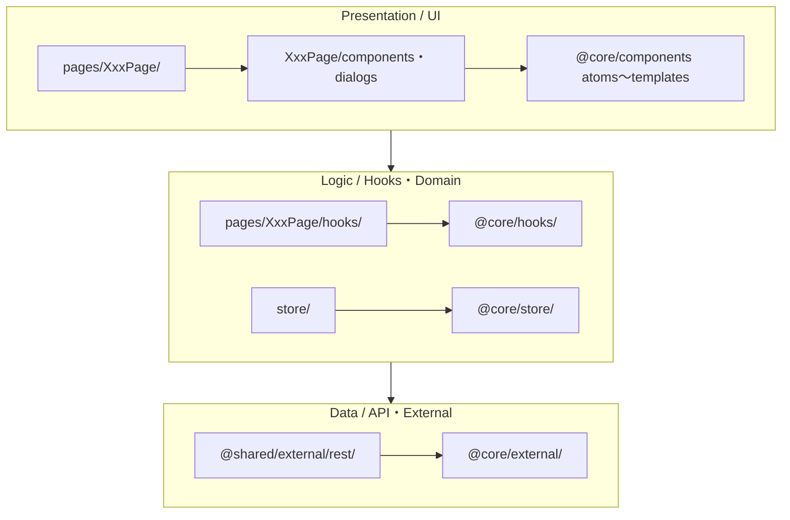

# FE 基本設計書（TS 世界）

> 本書は FE（React 19 + TypeScript monorepo）の具体設計を定義する。設計思想・契約の扱い・横断的な機械ゲート・検証計画は [00-全体.md](00-全体.md) を一次情報とし、本書は FE 固有の具体に絞る。
> **V-4（CSV 契約の機械検証）は FE の責務ではない**ため本書には書かない（[00-全体.md §8](00-全体.md)・[20-BE.md §5](20-BE.md)）。

出典: [`CLAUDE.md`](../../CLAUDE.md)・[`.claude/steering/01〜06`](../../.claude/steering/)・[`doc/architecture.md`](../architecture.md)・[`doc/jotai_patterns.md`](../jotai_patterns.md)・[`doc/state_boundaries.md`](../state_boundaries.md)・[`doc/rhf_patterns.md`](../rhf_patterns.md)・[`doc/api_client_migration.md`](../api_client_migration.md)・[`doc/storybook_msw.md`](../storybook_msw.md)・[`doc/testing_output.md`](../testing_output.md)。

---

## 1. 目的とスコープ

- 対象: React 19 + TypeScript の monorepo。pnpm workspace でアプリ群を束ね、共通基盤 `@core`（`packages/service`）は git submodule。
- バックエンドは外部 API として提供される。本リポジトリはその型インターフェースを `@core/external/api`（本番は契約から生成）に定義して**消費するだけ**で、API 仕様自体は持たない。
- FE が担う検証: V-1(TS 側) / V-2 / V-3 / V-5。

### 技術スタック（主要・出典: architecture.md）
React `^19` / react-router-dom `^7`（コード定義ルーティング）/ Jotai `^2.10` / React Hook Form `^7` + Zod `^3.22` + `@hookform/resolvers` / ts-pattern / i18next / Vite `^7` / Vitest `^4`(jsdom) / Testing Library / Playwright / Storybook + storycap + reg-suit / MSW `^2` / ESLint Flat Config v9 + Prettier / cspell / pnpm workspace / Node(Volta 固定)。依存はルート `package.json` に集約し、各アプリの package.json はスクリプトのみ。

---

## 2. アプリ構成と依存方向

出典: [`steering/01-architecture.md`](../../.claude/steering/01-architecture.md)。

### 2.1 アプリ構成
| 名前 | パス | 役割 |
|---|---|---|
| `@app` | `app/` | メインアプリ。デスクトップ / モバイルを単一コードで統合（レスポンシブ） |
| `@app-admin` | `app-admin/` | 管理者向け |
| `@app-ext` | `app-external/` | 外部公開向け |
| `@shared` | `shared/` | アプリ間共有 |
| `@core` | `packages/service/` | 全アプリ共通基盤（submodule） |

- デスクトップ / モバイルでアプリやコードを分けない。単一 `app` がレスポンシブで両対応（広い画面はサイドバー、狭い画面は vaul のハーフモーダル等）。
- ルーティングはコード定義ベース。`/ap` `/aps` `/apv` のプレフィックスでアプリを分ける。

### 2.2 パスエイリアスと依存方向
```
@core/*   → packages/service/src/*
@shared/* → shared/src/*
@app/*    → app/src/*（自分自身。アプリごとに @ap 等）
```
`tsconfig.json` の `paths` と `vite.config.ts` の `resolve.alias` を二重定義する（型チェックとビルドの両方で解決させるため）。



- 依存は UI → Logic → Data の一方向。逆向き禁止。共通層（`@core`/`@shared`）→ アプリ `pages/` の向きにだけ流し、共通層はアプリを参照しない。
- アプリ間の直接 import は禁止し、`import/no-restricted-paths` で機械強制する（§9）。

### 2.3 共有化の昇格基準
- 複数ページ、または 2 アプリ以上から参照 → `@shared` へ。
- 全アプリ共通 → `@core` へ。
- アプリ直下に共有置き場を作らないことで昇格を強制する。

---

## 3. 配置規約

出典: [`steering/01`](../../.claude/steering/01-architecture.md)・architecture.md。**層によって基準を分ける**（粒度で整理＝ライブラリ層、利用範囲で配置＝アプリ層）。

### 3.1 @core 内部（Atomic Design = ライブラリ層）
```
packages/service/src/
├── components/  atoms/ molecules/ organisms/ templates/ pages/
├── domain/      auth/ constants/ types/
├── external/    api/(API型) rest/(RESTクライアント) datadog/ storage/
├── hooks/  store/  error/  lib/  i18n/  tests/
```
- 参照は下位→上位の一方向（atoms→molecules→organisms→templates）。
- Atomic Design は `@core` 内だけで使う。アプリ層はこの分類を引き継がない。

### 3.2 アプリ層（ページコロケーション = アプリ層）
```
app/src/
├── pages/XxxPage/
│   ├── XxxPage.tsx     # 本体。hooks を組み立てて画面を構成するだけ
│   ├── components/     # ページ固有コンポーネント
│   ├── dialogs/        # ページ固有モーダル / ドロワー
│   └── hooks/          # ページのドメインロジック（API 呼び出しもここ）
├── routes/  components/(ルートガード) hooks/
├── providers/  store/(グローバル Jotai Atom)  i18n/  styles/
```
- **アプリ直下に `components/` `dialogs/` `hooks/` を置かない**。すべてページ配下へ。
- UI は `@core` の atom〜organism を組み立てて作る。アプリ側で atom を自前定義しない。
- ページのドメインロジックは `pages/XxxPage/hooks/` に集約し、`XxxPage.tsx` 本体はフックを呼んで結果を並べるだけにする。

| 変更の種類 | 置き場所 |
|---|---|
| 新しい画面 | `app/src/pages/XxxPage/` |
| ページ固有コンポーネント / モーダル | `pages/XxxPage/components/`・`dialogs/` |
| ページのドメインロジック / API 呼び出し | `pages/XxxPage/hooks/` |
| グローバル状態（Atom） | `app/src/store/` |
| 複数ページで使う部品 | `@shared/components/` へ昇格 |
| 全アプリ共通 UI プリミティブ | `@core/components/`（Atomic Design 粒度で配置） |
| ルート定義 / ガード | 各アプリ `routes/`・`routes/components/`（`PrivateRoute`） |

### 3.3 ルーティング
- `createBrowserRouter` + `createRoutesFromElements`。ネストルートと Provider ラッピングを組み合わせる。
- `PrivateRoute` が認証ガード・初期データフェッチ・共通レイアウトの 3 責務を担う。未認証時はフェッチ完了まで `null` を返す。認証不要ルートは `PrivateRoute` の外に置く。
- 動的振り分けは `ts-pattern` の `match` で型安全に行う。

---

## 4. 状態管理とフック責務

出典: [`steering/06`](../../.claude/steering/06-state-and-hooks.md)・jotai_patterns.md・state_boundaries.md。

### 4.1 状態管理の三層と棲み分け
- **URL は座標、ローカルストレージは好み、Jotai atom はその他すべて**。
  - URL（react-router）: ブックマーク可能にしたい位置情報（パスパラメータ・検索クエリ等）。
  - `atomWithStorage`: ユーザーの好み設定（ソート順・表示モード）。ユーザー別キーで localStorage と自動同期。
  - Jotai atom: 画面遷移で消えてよい一時状態（一覧データ・チェック状態・ドロワー開閉・ローディング）。
- **Context は場所、Jotai は値**。Context は React ツリーに依存するサービス（ポータル / 認証 / 非同期セッション / アプリ初期化データ）に限定する。
- **サーバーキャッシュ層を持たない**（TanStack Query / SWR 未採用）。API レスポンスはドメインフック内で直接 atom に `set` し、再取得は明示的な `refreshXxx()` で手動制御する（方針として手動管理コストを受容）。

### 4.2 atom 設計（jotai_patterns.md）
- グローバル状態は `store/`（`@app/store/` または `@core/store/`）に集約する。**ページ配下に store を置かない**。
- 単一責務・更新単位で分割・null 初期値で「未取得」を表現。命名は末尾 `Atom`、派生 `Selector`、書き込み専用 `WriteAtom`。
- 代表パターン: `atomWithReset` + `RESET` でクリーンアップ / `atomFamily` で ID 別キャッシュ / writable atom でリスト要素の部分更新 / `atomWithStorage`+`atomFamily`+ラッパーの三層で永続設定 / ドロワー排他制御。

### 4.3 フック責務（命名で責務を表す）
| 命名 | 責務 | 使う Jotai API |
|---|---|---|
| `useXxxState()` | Atom の読み取り専用ラッパー | `useAtomValue` のみ（副作用なし） |
| `useXxxAction()` | API 呼び出し + Atom 更新 + エラーハンドリング | `useAtomCallback` / `useAtomActionCallback`（再レンダリングを起こさない） |
| `useXxxDrawer()` / `useXxxModal()` | モーダル / ドロワー開閉（排他制御付き） | `useSetAtom`（開閉フラグのみ） |
| `useXxxRedirect()` | URL クエリに基づくリダイレクト | — |

- 読み取りと書き込みを分離し、読み取りだけのコンポーネントを書き込みロジックへ依存させない（不要な再レンダリングを抑える）。`useAtom`（読み書き同一）は使わない方針。

### 4.4 並行制御 / ローディング / エラー（一元化）
- `useSemaphoreCallback()`: ユーザー操作の重複実行を防ぐ（連打・連続ナビゲーションをブロック）。
- `useAtomActionCallback()`: `useAtomCallback` をラップし依存配列の安定性を保証する。
- `withAppLoading()`: API 呼び出しを囲むだけでローディング表示を自動切替。
- `p-limit`: 並行リクエスト数を制限（例: ファイルアップロード同時実行数）。
- エラーは `ApiError` で構造化し、`useErrorAction` / 各アプリの `useXxxErrorHandlingAction` に一元化する（エラーコード別に i18n メッセージを出し分け）。

---

## 5. API 消費

出典: [`steering/02`](../../.claude/steering/02-api-contract.md)・api_client_migration.md。詳細な契約原則は [00-全体.md §4](00-全体.md)。

- API 呼び出しは **hooks 内のみ**。ページ / コンポーネントから直接 fetch しない。生 fetch は ESLint で禁止する（§9）。
- 本番は OpenAPI から生成した **api-client 経由のみ**を経路とする（生成物は手書き改変しない）。生成物以外で fetch を持つ経路を作らない。
- API クライアントは**純粋関数**（React 非依存）。これを `useXxxAction` が呼ぶ。集約レイヤーはプレーンオブジェクト export（Context / Provider に依存させない＝新方式 `external/rest/`。旧方式 `external/api/` の Context 依存・カリー化は段階的に廃止中）。
- 実行時バリデーションは Zod。型と Zod の二重管理は `z.infer` で回避する。
- ケース変換は境界（`@core/external/rest`）で `camelcase-keys`/`snakecase-keys` に任せ、ドメイン型は camelCase。
- エラーは `ApiError`（`errorResponse.error.code`）で分岐する（§4.4）。

---

## 6. React 絶対ルール

出典: [`steering/03`](../../.claude/steering/03-react-rules.md)。React 公式 "Rules of React"。これらはガイドラインではなくルール。

- **純粋性**: 冪等。render 中で副作用を実行しない。props / state / Hook 引数戻り値 / JSX に渡した値は不変。
- **React が呼ぶ**: コンポーネント関数を直接呼ばない（JSX で使う）。Hook を値として渡し回さない。
- **Rules of Hooks**: Hook はトップレベルでのみ呼ぶ（ループ / 条件分岐 / ネスト関数の中で呼ばない・早期 return より前）。React 関数からのみ呼ぶ。
- **不要 useEffect の禁止**（プロジェクト上乗せ）: 派生状態の計算（→ レンダー中に計算）・状態の連鎖更新・イベントハンドラでやるべき処理を `useEffect` で書かない。条件分岐は `ts-pattern` の `match` で型安全に書く。
- Strict Mode 有効。`exhaustive-deps` は独自フック（`useSemaphoreCallback` / `useAtomActionCallback`）も対象に含める。違反は目視でなく lint で機械検知する（§9）。

---

## 7. 契約消費フロー（モックによる並行開発・V-3）

出典: PoC README / 親設計 §4.4・storybook_msw.md・testing_output.md。

- OpenAPI → codegen で型 / api-client / MSW ハンドラを生成する。本番経路（client）はモック（MSW）非依存に保つ（PoC では orval `mode: split` で実証）。
- モックは契約の `examples` を源泉とし、**手書きしない**（orval `useExamples: true`）。これにより「モックと本番の乖離」を構造的に消し、BE 未完成でも FE を作り進められる。
- MSW は 3 面で共有する: テスト（`setupServer`）/ Storybook（`msw-storybook-addon`）/ ローカル開発（`setupWorker`）。本番ビルドは `removeMSW` プラグインで除外する。
- モックと本番は同じ生成 api-client 1 本を通るため、BE 完成時は「向き先の差し替え」だけで FE は不変。
- **PoC の実証範囲**: 現状は「契約→モック→生成 client→消費」の**経路（データ）結合**まで（Vitest・node 環境）。React 描画（render→DOM）＝“画面”結合は V-5（ui-engine 導入）で完成し、テストランナーもそこで本決めする。

---

## 8. メタ定義駆動 UI（V-5）

出典: PoC 親設計 §6.3・rhf_patterns.md・[PoC v-5/基本設計.md](../../app/contracts_poc/doc/v-5/基本設計.md)。**PoC で実証済**（`@poc/ui-engine` ＋ React で同一ページが dept/price を render→DOM 描画）。FE フェーズの主目的。

- `ui-engine`: メタ定義（項目名・型・必須・コード値）を受け取り CRUD 画面（一覧＋登録/編集フォーム）を描画する。**マスタ個別の画面コードを書かない**（ADR-0003）。エンドポイントは `{masterId}` でパラメタライズし、マスタごとにパスを増やさない。
- フォームは React Hook Form + Zod（`@hookform/resolvers`）。`z.infer` / `z.input` で入出力型を導出し `useForm<Input, unknown, Output>` で型安全に submit を受ける。スキーマは `validation.ts` に分離する。
- 状態境界: RHF の `useForm` はフォーム内に閉じる。`defaultValues` は props 経由（atom → Stateフック → props）で渡し、submit のコールバックでドメインフックが API を叩き atom を更新する。atom ↔ フォームの直接バインドは避ける。
- エラー表示: クライアント（Zod）はフィールド直下にインライン、サーバーは `ApiError` → ダイアログ（表示レイヤーを分ける）。二重送信は `formState.isSubmitting` + `useSemaphoreCallback` + `withAppLoading` で防ぐ。
- V-5 で React/Next/ui-engine を導入することで V-3 が真の画面結合へ昇格する（§7）。

---

## 9. 機械ゲート（FE）

出典: [`steering/04`](../../.claude/steering/04-typescript.md)・[`05`](../../.claude/steering/05-enforcement.md)・README スクリプト表・storybook_msw.md・testing_output.md。横断ゲートの一覧は [00-全体.md §6](00-全体.md)。

| 規約 / 守りたいこと | 強制手段 | タイミング |
|---|---|---|
| 型安全（strict / no-any・契約破壊が消費コードを止める＝V-1） | `tsc --noEmit`（strict / noErrorTruncation / isolatedModules） | コミット前 / CI |
| 契約⇔生成物のドリフト・生成物手書き改変 | codegen:check（再生成して `git diff --exit-code`） | 編集後 / CI |
| 生 fetch 直書き禁止（V-2） | ESLint（no-restricted-globals / no-restricted-syntax） | 編集後 / CI |
| レイヤ依存方向・生成物直参照禁止（V-2） | dependency-cruiser | 編集後 / CI |
| アプリ間直接参照禁止 | import/no-restricted-paths | 編集後 / CI |
| Rules of Hooks / 純粋性 | eslint-plugin-react-hooks ＋ Strict Mode | 編集後 / CI |
| 不要 useEffect の禁止 | react-you-might-not-need-an-effect（全8ルール error） | 編集後 / CI |
| 独自フックの deps チェック | exhaustive-deps（`useSemaphoreCallback` 等を対象に追加） | 編集後 / CI |
| 命名規約 | @typescript-eslint/naming-convention | 編集後 / CI |
| import 順 | import/order（internal→relative→builtin→external・アルファベット順） | 編集後 / CI |
| コードスタイル | ESLint(Flat Config v9) + Prettier | コミット前 / CI |
| スペル | cspell | コミット前 / CI |
| 振る舞い（単体 / 統合） | Vitest(jsdom, globals) + Testing Library（`useJotaiTestWrapper` でフック / atom テスト） | CI |
| E2E | Playwright | CI |
| ビジュアル回帰（VRT） | Storybook + storycap + reg-suit | CI |
| コミット前一括 | simple-git-hooks + lint-staged | コミット前 |

- ローカル CI 相当の一括スクリプト（PoC 実績）: `codegen:check → typecheck → lint → depcruise → test`。
- テスト責務分担: 純粋関数 / hook / atom は Vitest（atom 更新の正当性に焦点・`useJotaiTestWrapper` とカスタムマッチャー `toBeUpdatedWith` 等）、プレゼンテーションコンポーネントは Storybook + VRT で視覚確認、API 通信は MSW、それ以外は `vi.mock`。

---

## 10. 検証と残作業

| V | FE での状況 | エビデンス |
|---|---|---|
| V-1（TS 側） | 実証済（契約 yaml の項目リネームで消費コードが `TS2551` 等で停止） | [PoC README V-1](../../app/contracts_poc/README.md) |
| V-2 | 実証済（生 fetch / 層飛ばし / 逆流 / 生成物手書きが lint・depcruise・codegen:check で停止） | [PoC README V-2](../../app/contracts_poc/README.md) |
| V-3 | **経路結合まで実証済**。MSW モックのみで BE ゼロのまま結合テストが通る | [PoC README V-3](../../app/contracts_poc/README.md) |
| V-5 | **実証済**。`@poc/ui-engine`(汎用メタ駆動レンダラ)＋ React で同一 `<MasterCrudPage>` が dept/price を render→DOM 描画。入力UI/一覧カラム/Zod バリデーションをメタから機械導出。V-3 が画面結合へ昇格・ランナーは Vitest(jsdom) で本決め(Next は未導入・本番化軸) | [PoC v-5/検証メモ.md](../../app/contracts_poc/doc/v-5/検証メモ.md) |

- V-5 完了で FE-native（V-1,2,3,5）が出揃い FE フェーズ一旦完了（[00-全体.md §9](00-全体.md)）。
- V-1 の Java 側（双方向）・V-4・ArchUnit・双方向 contract test は BE フェーズ（[20-BE.md](20-BE.md)）。
