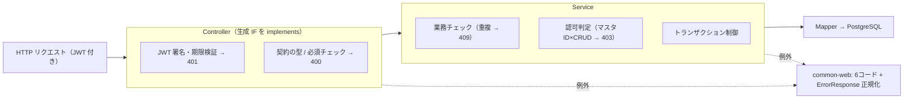

# BE 基本設計書（Java 世界）

> 本書は BE（Spring Boot / Java）の具体設計を定義する。設計思想・契約の扱い・横断的な機械ゲート・検証計画の全体像は [00-全体.md](00-全体.md) を一次情報とし、本書は BE 固有の具体に絞る。
> **BE の実コードはまだ存在しない**。本書は「設計＋検証計画」が中心であり、実装値（マスタ名・エラーコード採番・認可モデル）は**ダミー / 未確定として明示**する。FE フェーズで TS のみ実証した部分（V-1 双方向）の Java 側を埋める位置づけ。

出典: PoC 親設計 [`基本設計.md`](../../app/contracts_poc/doc/基本設計.md) §2.1 / 2.2 / 3 / 4.3 / 5 / 6.2 / 7・[`v-4-見送り判断.md`](../../app/contracts_poc/doc/v-4-見送り判断.md)。

---

## 1. 目的とスコープ

- 対象: BE = Spring Boot。サービス縦割り（`services/master/{api,batch,db}`）＋ Java 共通基盤 `libs-java/common-web`。
- BE が担う検証: V-4（CSV 契約）・V-1 の Java 側（双方向 codegen）・ArchUnit・双方向 contract test。
- PoC は master 1 サービスのみの縦切り（本番モノレポの縮小相似形）。本番は transaction / accounting / gw を**同形で増やすだけ**（親設計 §9）。
- スコープ外（明示・親設計 §7.3）: transaction / gw サービス・会計連携・社外 API・取込側 CSV（vehicle-import）・性能 / 可用性 NFR・監視基盤連携・認可モデルの設計確定。

---

## 2. サービス構成と依存

出典: 親設計 §2.1 / 2.2 / 3・ADR-0001。

```text
（本番モノレポ。PoC は master 1本に縮小）
contracts/                          ← 正の中心（全サービスの上位・[00-全体.md §4]）
libs-java/
  └ common-web/                     ← Java 共通（業務ロジック禁止）。エラー正規化・相関IDログ
services/
  └ master/                         ← サービス縦割り（api / batch / db）
      ├ api/    (Spring Boot: Controller → Service → Mapper)
      ├ batch/  (CSV出力。出力前に生成バリデータで契約照合)
      └ db/     (DDL・メタ定義シード・認可スタブシード)
ci/                                 ← ArchUnit / codegen:check / contract test
```

- **リポ分割・言語別分割をしない**。横断資産（`contracts` / `libs-java`）に業務ロジックを置かない（ADR-0001）。
- サービス間の直接依存なし。本番でサービスを増やすときも master と同形・直接依存なしを保つ。
- `common-web` は本番 common-web の骨格。PoC では監視基盤連携は対象外で、ログ出力形式のみ合わせる。

---

## 3. レイヤと責務

出典: 親設計 §3 / 5・ADR-0008。



| レイヤ | 責務 | 置かないもの |
|---|---|---|
| Controller | 生成 IF の implements・JWT 署名/期限検証（401）・契約の型/必須チェック（400） | 認可判定・業務ロジック |
| Service | 業務チェック（重複 409）・**認可判定**（403）・トランザクション制御 | — |
| Mapper | 取得 / 書込（PostgreSQL） | 業務ロジック・認可 |

- **認可判定は Service 層のみ**（ADR-0008）。FE / BFF / Controller / Mapper に書かない。認可スキップ分岐を作らない。
- 例外は `common-web` が 6 コード＋`ErrorResponse` に正規化してから返す（§7）。

---

## 4. 契約消費（双方向 codegen）

出典: 親設計 §4.1 / 5.4・[00-全体.md §4](00-全体.md)。**V-1 の Java 側**にあたる（FE フェーズでは TS 側のみ実証済）。

- OpenAPI（`contracts/http/*.yaml`）→ **Java interface / model** を生成する。Controller はその生成 IF を implements する。
  - **V-1（Java 側）合格基準**: 契約 yaml のレスポンス項目をリネーム／契約外エンドポイントを追加すると、Controller が**コンパイルエラー**（または ArchUnit の implements 強制）で止まる。
- JSON Schema（`contracts/files/*.schema.json`）→ **Java DTO ＋バリデータ**を生成する（§5 / V-4）。
- 方向は常に契約→コードの一方向。コードから契約を生成しない。AI に契約を直接編集させない（ADR-0002 / 0009）。
- **生成物の手書き改変禁止**。再生成で上書きされる前提とし、codegen:check（差分ゼロ）で検知する（§8）。
- codegen ツール: FE は orval 採用実績あり。Java 側（openapi-generator 等）は PoC / BE フェーズ内で比較選定し、選定理由を記録して本番判断の入力とする（前提 P-5・未確定）。

---

## 5. ファイル連携（V-4）

出典: 親設計 §4.3 / 5.4 / 6.2・[`v-4-見送り判断.md`](../../app/contracts_poc/doc/v-4-見送り判断.md) §3 / 4。**本書にのみ具体を置く**（FE 設計書には書かない）。

### 5.1 責務と方針
- 配布 CSV は **BE ↔ 外部システム**の責務。`services/master/batch`（Spring Boot）が出力する。FE はファイルに触れない（FE が関与するのは精々アップロード UI の拡張子・サイズ等の最低限バリデーションまでで、本格的な契約照合は BE）。
- **契約**: `contracts/files/*.schema.json`（JSON Schema）。レコード項目・型・桁・コード値を定義する。
- **ファイルメタ**（文字コード=UTF-8 / 区切り=カンマ / ヘッダ=有 / 改行=CRLF）も**契約に同居**させる（JSON Schema の拡張プロパティ等）。CSV の入出力もそこから駆動し、手書き定数にしない。

### 5.2 出力フロー（V-4 の主役）
```text
batch 起動（ローカルコマンド / 本番は StepFunctions・CronJob）
  → Service 経由でレコード抽出
  → 生成 DTO へ詰め替え
  → 生成バリデータで契約照合（契約外は異常終了 ＋ 件数ログ）
  → CSV 出力（ファイルメタも契約準拠）
```
- **V-4 合格基準**: JSON Schema から生成した DTO＋バリデータにより、契約外 csv（例: 契約外の桁数）が**出力直前に弾かれ異常終了**する。
- **取込/出力は同一の生成バリデータで照合**する（片肺チェック・二重管理を作らない）。FE で通信経路を api-client 1 本に固定したのと同じ考え方をファイル契約へ適用する。取込側（vehicle-import）自体は親設計でもスコープ外。

### 5.3 バッチ共通枠（ADR-0011）
- 冪等性・0 件正常終了・処理時間ログを共通枠として持ち、個別バッチで再実装しない。共通枠の「置き場」は common-batch 相当に分離する（本番化で実行基盤を差し替えても個別バッチは不変）。

### 5.4 持ち越した気づき（v-4-見送り判断.md §3）
- 「契約→生成→I/O 境界で機械照合＋codegen:check でドリフト検知」という思想は HTTP でもファイルでも同型に効く。
- TS(ajv)で組んでも本番の Java ツールチェーンとは別物となり「検証」にならないため、V-4 は Java で実施する（TS 試作は revert 済・知見のみ持ち越し）。
- 実装メモ（TS で再挑戦する場合の注意）: ajv standalone は `maxLength`/`minLength` が `ucs2length` runtime を require し ESM 生 node で割れる（CommonJS 出力で回避）。「テストが緑でも本番ランタイムで割れる」例。Java で組むなら無関係。

---

## 6. 認証・認可

出典: 親設計 §5.3・ADR-0008。横断方針は [00-全体.md §7](00-全体.md)。

```text
1. Controller: JWT 署名・期限検証 → 失敗 401
2. クレーム解決: sub → スタブユーザーテーブル照合 → 解決不能 401
3. Service: マスタID × CRUD で認可スタブ照合 → 権限なし 403
4. 監査ログ出力（相関ID付き）
```

- 検証するのは「**判定の置き場（Service 層）とフローの形**」。スタブのテーブル構造を本番スキーマ案として扱わない。
- **前提の明示（未確定）**:
  - 認証は Cognito 未接続。ローカル発行の**固定 JWT** で 401 系フローのみ検証（P-2）。本番は Cognito へ接続（Controller 入口の検証は `libs-java` 側で差し替え）。
  - 認可マスタは**スタブテーブル**。認可モデル（ロール体系・粒度）は未確定（90 C-2）で勝手に確定させない（P-3）。本番は提供される認可情報スキーマ確定後に差し替え（判定の置き場は不変）。

---

## 7. エラー処理

出典: 親設計 §3 / 5.2・error-standards。横断のエラー型は [00-全体.md §5.2](00-全体.md)。

- `libs-java/common-web` が例外を **6 コード＋`ErrorResponse`**（エラーコード・メッセージ・相関 ID）に正規化する。HTTP ステータスは 6 コードのみ（ADR-0010）。
- 相関 ID 付きでログ出力する。FE は正規化された `ErrorResponse` を受けて共通エラー画面へ遷移する（個別エラー画面を作らない）。
- エラーコード採番（`PJ-MST-0001` 形式）は error-standards 確定待ちのため**ダミー採番と明記**して使用する（P-4・未確定）。

### 同期 API の概要（contracts/http・親設計 §6.1）
`{masterId}` でパラメタライズし、マスタごとにパスを増やさない（メタ定義駆動・ADR-0003）。

| メソッド/パス | 役割 | 主な応答 |
|---|---|---|
| `GET /poc/masters/{masterId}/meta` | メタ定義取得 | 200 / 404 |
| `GET /poc/masters/{masterId}/records` | 一覧（Paging・簡易フィルタ） | 200 / 401 / 403 |
| `GET /poc/masters/{masterId}/records/{id}` | 1 件取得 | 200 / 404 |
| `POST /poc/masters/{masterId}/records` | 登録 | 201 / 400 / 403 / 409 |
| `PUT /poc/masters/{masterId}/records/{id}` | 更新（楽観排他: バージョン番号） | 200 / 400 / 403 / 404 / 409 |
| `DELETE /poc/masters/{masterId}/records/{id}` | 削除 | 204 / 403 / 404 |

---

## 8. 機械ゲート（BE）

出典: 親設計 §2.2 `ci/`・§9・[00-全体.md §6](00-全体.md)。**規約はどのゲートが落とすかとセットで定義する。**

| 規約 / 守りたいこと | 強制手段 | タイミング |
|---|---|---|
| レイヤ依存方向（Controller→Service→Mapper・逆流禁止） | **ArchUnit** | CI |
| Controller が生成 IF を implements している（契約外 API を生やさない・V-1 Java 側） | **ArchUnit（implements 強制）** | CI |
| サービス間直接依存なし・横断資産に業務ロジックを置かない | ArchUnit | CI |
| 契約⇔生成物のドリフト・生成物手書き改変 | codegen:check（再生成して差分ゼロ） | CI |
| 契約破壊が Controller を止める（V-1 Java 側） | javac コンパイル（生成 IF implements） | CI |
| CSV 出力が契約に従う（V-4） | 生成バリデータ（出力前照合・異常終了＋件数ログ） | バッチ実行時 |
| モックと本物 BE が同一契約に従う | **双方向 contract test（Pact / schema 突合）** | CI |
| 振る舞い（単体 / 統合） | JUnit | CI |

- **双方向 contract test**: FE が使う MSW モックと本物 BE が同一契約に従うことを保証する（モックと実装の乖離を機械で塞ぐ）。FE 側で V-3（契約 examples 由来モック）と接続する。

---

## 9. 本番化

出典: 親設計 §9。本番化は別軸（[00-全体.md §9](00-全体.md)）。判定の置き場・契約構造は不変のまま、差し替えで対応する。

| 項目 | PoC / 初期 | 本番 |
|---|---|---|
| 認証 | 固定 JWT（ローカル発行） | Cognito 接続（Controller 入口の検証を `libs-java` で差し替え） |
| バッチ実行基盤 | ローカル起動 | StepFunctions / CronJob（共通枠の置き場が分離済みのため個別バッチは不変） |
| 認可 | スタブテーブル | 提供される認可情報スキーマ確定後に差し替え（判定は Service 層のまま） |
| サービス | master 1 本 | transaction / accounting / gw を同形で追加（サービス間直接依存なし） |
| DB | docker-compose の PostgreSQL | 本番 DB |

---

## 10. 検証

| V | BE での状況 | 備考 |
|---|---|---|
| V-1（Java 側・双方向） | **BE フェーズ**。FE フェーズでは TS 側のみ実証済 | 契約改変で Controller がコンパイルエラー（§4） |
| V-4（CSV 契約） | **BE フェーズ**。TS 試作→revert 済（[v-4-見送り判断.md](../../app/contracts_poc/doc/v-4-見送り判断.md)） | JSON Schema→DTO＋バリデータ→出力前ゲート（§5） |
| ArchUnit | **BE フェーズ** | レイヤ依存・生成 IF implements 強制（§8） |
| 双方向 contract test | **BE フェーズ** | モックと本物 BE が同一契約（§8） |

- 本書は FE フェーズで TS のみ実証した部分の Java 側を埋める位置づけ。実コード着手時は本書の設計＋検証計画を出発点とし、ダミー / 未確定（認可モデル・エラーコード採番・codegen ツール）を一次情報確定に合わせて差し替える。
